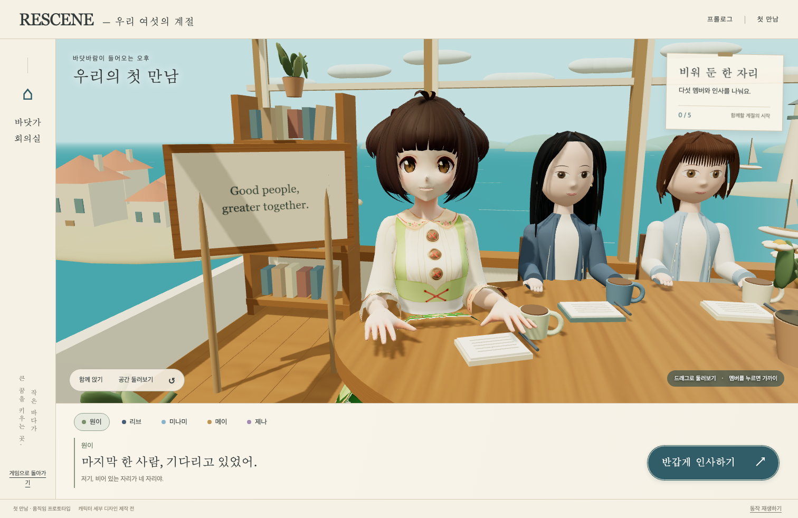
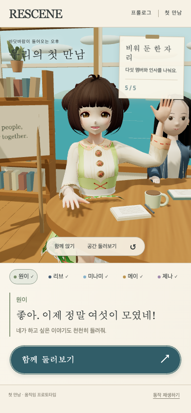

# 원이 자리의 3D 모델 교체 검증

사용자가 거부한 절차적 캐릭터의 얼굴 수치를 다시 조정하는 방식에서 벗어나, 실제 제작된 VRM 모델을 적용했다. **원이 자리 한 곳에 적용한 교체 후보**이며, 나머지 네 멤버는 기존 모델이다. 원이의 실제 외형이나 승인 시안과 동일한 최종 모델은 아니다.

## 실제 화면

## 적용 범위

- VRoid Project의 베타 AvatarSample_2 / Vivi 모델을 로컬 자산으로 사용한다. 얼굴 메시, 머리카락, UV 텍스처, 전신 스켈레톤과 표정을 갖춘 모델이다.
- 회의실에서 머리·골반 높이를 맞추고 실제 인체 뼈대로 앉기·인사·고개·눈 깜빡임을 연결했다. 머리와 눈동자는 갈색 계열, 재질은 회의실 조명을 받는 PBR로 조정했다.
- 모델 구조를 정적 메시 병합에서 제외해 스켈레톤·표정을 보존한다. 몸통·팔·다리가 실제 스켈레톤을 따라 움직인다.
- 모델 로딩 실패는 명시적으로 표시하며, 거부된 이전 원이 모델을 조용히 대신 표시하지 않는다.
- 실제 체험: http://127.0.0.1:4321/survival-3d.html — **원이 버튼을 누르면 가까이 볼 수 있다.**
- 브랜치 `feat/survival-3d-first-meeting-20260929`, [PR #4](https://github.com/hhj4861/rescene-game/pull/4). 로컬 미리보기 및 작업 브랜치 적용이며 머지·운영 배포와 별개다.

## 출처와 사용 조건

저작권자 pixiv의 [베타 AvatarSample_2 공식 안내](https://vroid.pixiv.help/hc/en-us/articles/360014900273)는 해당 모델을 CC0로 공개하고 수정·사용을 허용한다. 최신 VRoid 샘플 전체가 같은 조건이라는 뜻은 아니다.

파일은 [OpenGameArt의 CC0 베타 샘플 묶음](https://opengameart.org/content/vroid-studio-cc0-models)의 AvatarSample_E.vrm을 사용했다. 원본 바이너리와 내부 출처를 보존했다. [자산 출처·해시](../../public/assets/survival-3d/characters/woni-base.LICENSE.md)에 정확한 링크와 변경 범위를 기록했다.

## 구현과 검증

`@pixiv/three-vrm` 3.5.5와 기존 Three.js 0.180.0을 고정하고 필요한 로더를 로컬 정적 번들로 제공한다. 로더는 `node tools/survival/build-avatar-loader.mjs`로 재생성할 수 있다. 별도 CDN이나 외부 모델 서버를 호출하지 않는다.

GLB 내부 이미지 디코딩에 필요한 blob URL을 **3D HTML 페이지의 img-src·connect-src에만** 추가했다. script-src는 self, 기존 게임 페이지의 CSP는 그대로다. 내부 이미지 blob 요청과 실제 외부 네트워크 요청을 검증에서 구분한다.

[브라우저 검증 원본](3d-avatar-replacement/verification.json)은 실제 모델 로딩, 스켈레톤 보존, 머리·골반 위치, 인사 시 손 상승, 눈 깜빡임·시선, 선택·카메라·모바일, 일시정지, 모델 누락·GPU 실패, 기존 테스트 저장 보존을 기록한다.

검증 결과: 기존 survival 테스트 45개, 변경 코드 ESLint, Chromium·WebKit E2E를 통과했다. 최초 전체 장면은 497,563 triangles / 340 draw calls이며 앱 오류·외부 네트워크·AI 호출은 없었다. WebKit 캡처 도구의 스타일 주입으로 발생한 CSP 진단 6건은 앱 오류와 분리해 원본 결과에 기록했다. 모델 누락 오류, 정지 중 화면 유지, 모바일 선택·인사, 기존 게임 CSP와 저장 데이터 보존도 확인했다.

## 남은 차이

이 모델은 Vivi라는 기존 샘플 캐릭터다. 얼굴과 의상은 원이 전용으로 제작되지 않았으며 시안의 후드·스타일과 다르다. 다른 네 멤버, 배경, 시안 수준의 조명·재질 완성도는 이번에 교체하지 않았다. 특히 샘플 의상의 치맛단은 앉은 자세용으로 제작된 의상이 아니므로 전용 의상과 자세에 맞춘 후속 작업이 필요하다. 교체 모델의 기술적 동작 검증을 캐릭터 디자인 승인으로 간주하지 않는다.
