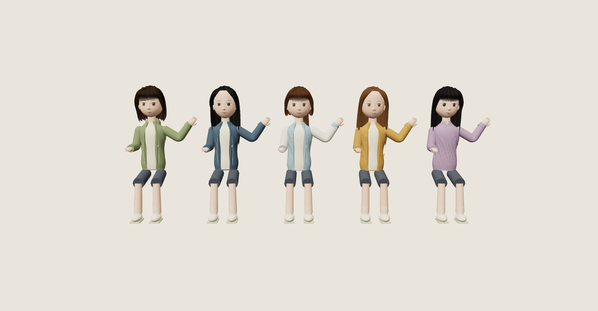

# 3D 캐릭터 관절과 모델 초안 — 2026-09-29

현재 첫 만남 체험에 어깨·팔꿈치·손목 관절, 미소, 고개 반응을 적용했다. 다섯 캐릭터를 편집 가능한 GLB로 내보내고 다시 불러와 애니메이션이 유지되는 것을 확인했다. **시안과 일치하는 최종 외형 제작은 아직 완료되지 않았다.**

- 체험: http://127.0.0.1:4321/survival-3d.html
- 작업 브랜치: `feat/survival-3d-first-meeting-20260929`
- PR: https://github.com/hhj4861/rescene-game/pull/4 — 머지 전
- 기존 게임(4317)의 저장·LLM 설정과 독립된 시각 체험이다. 인사 대사는 사전 작성 문구다.

## 이번 적용

기존에는 인사하는 순간 쉬고 있던 팔을 숨기고 별도의 올린 팔을 표시했다. 이제 동일한 소매 메시가 세 관절과 스킨 가중치에 따라 변형되며, 팔 올리기 → 손목 흔들기 → 내려놓기로 이어진다. 얼굴과 입술에는 미소 모프를 적용했다. 인사 시점은 멤버마다 보관하므로 선택을 바꿔도 인사 동작이 다른 멤버에게 옮겨가지 않는다. 일시정지하면 캐릭터의 현재 관절·표정 상태를 유지한다.

정적 메시를 합치는 최적화에서 스킨 메시·모프 타깃·본 계층을 보존한다. 페이지 종료 시 스켈레톤 GPU 자원도 정리한다.

## 편집 가능한 자산

[모델 목록과 검증 정보](../../public/assets/survival-3d/characters/manifest.json)

- [원이](../../public/assets/survival-3d/characters/woni.glb)
- [리브](../../public/assets/survival-3d/characters/liv.glb)
- [미나미](../../public/assets/survival-3d/characters/minami.glb)
- [메이](../../public/assets/survival-3d/characters/may.glb)
- [제나](../../public/assets/survival-3d/characters/zena.glb)

각 파일에는 내장 텍스처, 스킨 메시 2개, 얼굴·입술 모프 메시 3개, `idle`·`greeting` 애니메이션이 포함된다. `idle`은 반복용이며 `greeting`은 한 번 재생하는 용도다. 캐릭터는 원점 기준의 앉은 자세이고 의자는 포함하지 않는다. 제삼자 모델이나 유료 서비스를 사용하지 않고 저장소의 절차적 형상에서 생성했다.

체험은 같은 절차적 소스로 직접 렌더링한다. GLB 파일은 후속 편집·교체를 위한 산출물이며 체험 페이지에서 이 파일들을 내려받아 표시하는 방식은 아직 아니다. 생성 도구의 임시 자산 작업 화면과 exporter/loader는 게임 서버에 공개하지 않는다.

다음은 **내보낸 GLB를 다시 불러와** 인사 애니메이션을 재생한 화면이다. 승인된 시안을 대신하는 새 시안이 아니다.



재생성:

```sh
node tools/survival/build-character-models.mjs
```

## 검증

- `node --test tests/survival/*.test.mjs`: 45개 통과. 처음 제한 환경에서는 포트 바인딩 EPERM으로 API 테스트 7개가 실패했으며, 로컬 포트 사용이 허용된 실행에서 전체 재검증했다.
- 변경 JS의 ESLint와 `git diff --check`: 통과.
- `node tools/survival/verify-3d.mjs`: Chromium·WebKit 통과. 스킨 변형(손목 부근 정점 이동 약 0.498), 미소 모프, 메시 병합 후 보존, 다섯 인사, 선택·카메라·터치·키보드, 모바일 390px, 일시정지 이미지 동일성, reduced motion, WebGL 실패/연결 소실 처리를 확인했다.
- 두 엔진의 초기 전체 화면: 457,509 triangles / 269 draw calls. 실제 휴대폰 FPS 측정 결과는 아니다.
- 앱 오류 0, 외부/AI API 호출 0, 기존 테스트 저장 파일 바이트 보존.
- WebKit 캡처 도구 자체의 스타일 주입 CSP 진단 5건은 기존 검증과 동일하게 별도 기록했다. 앱 CSP는 완화하지 않았다.
- GLB 5개 실제 재로딩: 각 2개 스킨 메시·3개 모프 메시·2개 클립 보존, 인사 본 회전 및 미소 값, 정점 가중치 합 검증 통과. 개별 파일 크기는 약 5.8–7.2 MB다.

[브라우저 검증 원본](3d-character-motion/verification.json)

## 남은 외형 제작

현재 자산은 앉은 장면용 기술 초안이다. 전신 휴머노이드 리그, 걷기·춤·입 모양 동기화는 포함하지 않는다. 얼굴의 닮음, 헤어·의상 디테일, 하체 연결부와 토폴로지 정리, 시안에 맞춘 재질·조명 조정이 필요하다. 원이 한 명을 기준으로 시안과 비교하며 외형을 완성한 뒤 나머지 멤버에 확장하는 것이 다음 작업이다.
