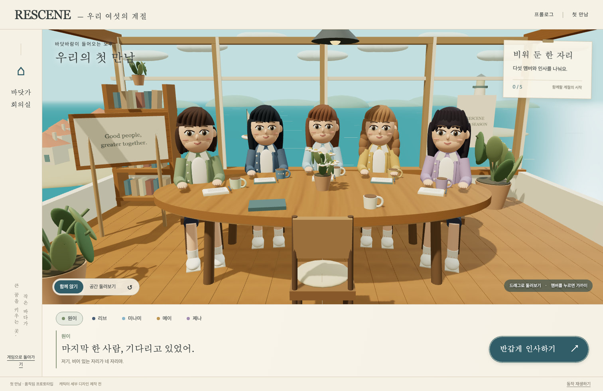
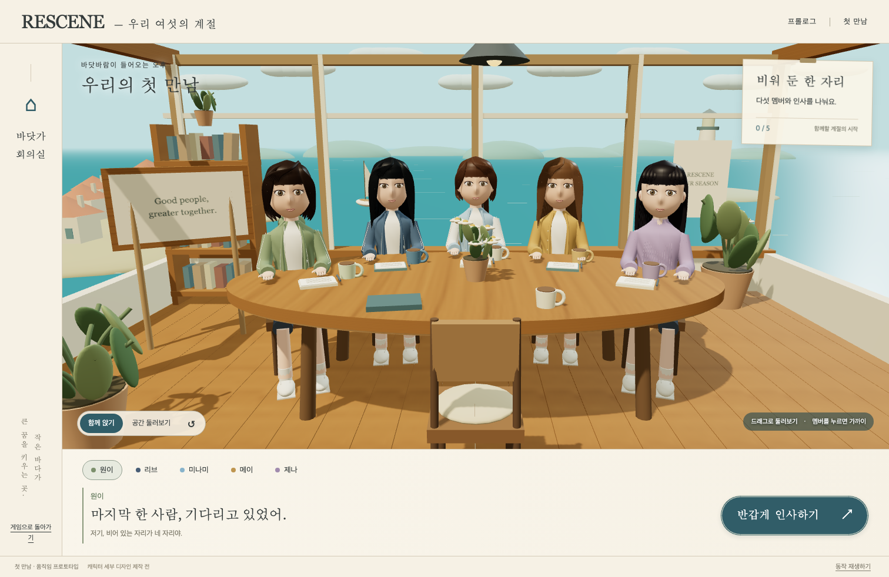
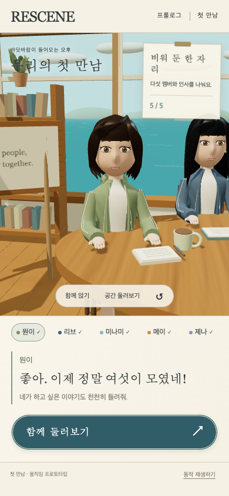
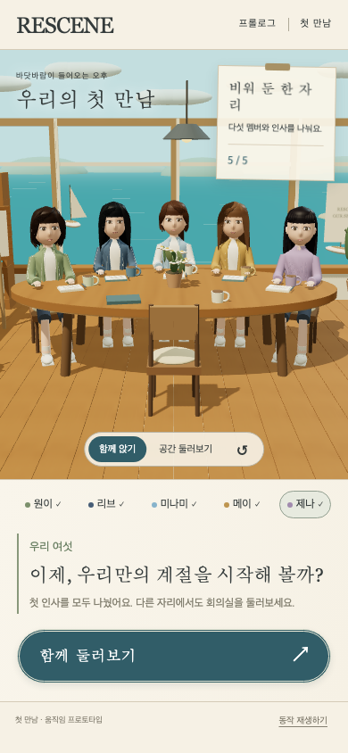

# 첫 만남 캐릭터 표면·의상 개선

2026-09-29. PR #4의 첫 만남 3D 프로토타입을 이어서 개선했다. 실행 주소는 `/survival-3d.html`이며 기존 시즌 게임과 별도로 동작한다.

## 변경한 표현

- 얼굴: 볼·턱·이마·코를 하나의 연속된 메시로 구성했다. 피부·볼 색을 버텍스 색으로 표현하고, 정적 메시 결합 과정에서도 색 속성을 보존한다. 머리 비율과 눈매·얼굴 폭을 멤버별로 다르게 설정했다.
- 눈: 입체 안구 부품을 작은 아몬드형 눈 표면으로 바꾸고 홍채 결·하이라이트·속눈썹을 더했다. 눈 깜빡임은 유지했다.
- 헤어: 단발·긴 생머리·묶은 머리·웨이브·앞머리의 실루엣을 구분했다. 곡선을 따라 굵기가 줄어드는 입체 머리카락과 결 텍스처를 사용한다.
- 의상: 원이의 녹색 후드, 리브의 남색 재킷, 미나미의 밝은 소매 재킷, 메이의 카디건, 제나의 니트를 구분했다. 곡면을 따르는 안쪽 옷·지퍼·단추·소매선·니트 결과 손끝을 추가했다.
- 시선: 선택된 멤버의 머리가 카메라 방향을 따라간다. 과도하게 돌아가지 않도록 회전 범위를 제한하고, 동작 정지 상태에서는 카메라 조작에 필요한 시선만 갱신한다.

형상과 텍스처는 코드로 생성한다. 모델·사진 다운로드나 새 런타임 의존성은 추가하지 않았다. 캐릭터는 실제 인물의 외모를 재현한 완성 모델이 아니라 게임 프로토타입의 표현이다.

## 실제 화면

이전 단계:

이번 단계:

## 확인 범위와 한계

Chromium·WebKit 체험 검증, 기존 게임 테스트 41개, 변경 JS ESLint가 통과했다. 검증 명령은 `node tools/survival/verify-3d.mjs`, `node --test tests/survival/*.test.mjs`다. 브라우저 검증은 실제 WebGL 렌더링·메시 선택·다섯 인사·카메라·드래그·키보드·모바일 터치·정지·감소된 동작·WebGL 실패 안내와 저장 보존을 확인한다. 실제 실행 결과는 [verification.json](3d-character-refinement/verification.json)에 기록한다. 기본 시점 렌더링은 446,949개 삼각형, 257회 드로 콜이며 실기기 프레임 성능 측정값은 아니다.

WebKit 스크린샷 시 Playwright가 애니메이션 동기화를 위해 삽입하는 빈 인라인 스타일은 서버 CSP에 의해 차단된다. 캡처 도중의 정확한 해당 진단 5건만 따로 기록하며 앱 오류는 별도로 검사한다. 보안 정책을 완화하지 않았다.

이 개선으로 승인한 고품질 3D 시안과 동일한 외형이 완성된 것은 아니다. 전용 제작 모델의 얼굴·헤어·의상 품질, 스킨 메시와 표정 리깅, 립싱크, 공연 안무, 다른 스토리라인 3D 전환은 아직 남아 있다. 대화는 고정된 첫 인사 예시이며 Gemini를 호출하지 않는다. 모바일 실기기 프레임 성능은 이 브라우저 검증으로 보장하지 않는다.
