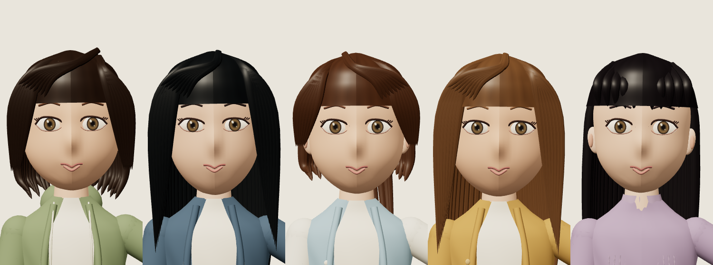
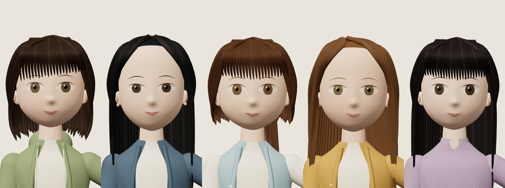

# 멤버 외형 개선 — 2026-09-29

다섯 멤버의 얼굴·눈·입술·헤어 형상을 수정했다. 현재 모델의 얼굴 중앙 음영 단절, 앞에 붙인 듯한 눈, 길게 보이는 아래 얼굴, 두꺼운 입술 선과 반복적인 머리카락 형태를 개선하는 작업이다. **승인된 시안과 동일한 고품질 캐릭터 모델을 완성했다는 의미는 아니다.**

## 같은 조건의 전후 비교

원이 → 리브 → 미나미 → 메이 → 제나 순서다. 같은 조명, 정면 카메라, 인사 애니메이션 1.1초 시점의 GLB 재로딩 결과를 촬영했다. 아래 이미지는 이미지 생성 시안이 아니라 실제 내보낸 3D 모델의 렌더링이다.

수정 전:

수정 후:

## 변경 내용

- 얼굴·두피의 UV 경계에서 양쪽 법선을 평균 내어 얼굴 중앙에 생기던 조명 경계를 제거했다. 미소 모프에도 동일하게 적용한다.
- 눈 표면과 눈꺼풀을 얼굴 깊이에 맞췄다. 눈동자 색과 크기, 눈꼬리 각도, 눈썹 굵기와 형태를 조정했다.
- 아래 얼굴의 길이를 줄이고 턱·볼·코 곡면을 수정했다. 입술은 튜브 선에서 얼굴 위의 얇은 입술 표면으로 교체했다.
- 멤버별 피부·눈동자·얼굴 비율을 구분하고, 앞머리·가르마·옆머리·뒤쪽 볼륨을 다시 구성했다. 머리 재질의 광택을 낮추고 가는 머리 묶음을 추가했다.
- 기존 관절 인사·미소·눈 깜빡임을 유지하고 GLB 5개를 갱신했다.

## 실제 적용 위치

- 로컬 체험: http://127.0.0.1:4321/survival-3d.html — 새로고침하면 변경된 절차적 모델을 표시한다.
- 모델 파일: `public/assets/survival-3d/characters/*.glb`
- 생성·확인: `node tools/survival/build-character-models.mjs`
- 작업 브랜치: `feat/survival-3d-first-meeting-20260929`, [PR #4](https://github.com/hhj4861/rescene-game/pull/4). 머지·운영 배포와 별개다.

## 검증

캐릭터 동작 단위 테스트 4개, 변경 JS ESLint와 `git diff --check`가 통과했다. GLB 5개를 실제로 다시 불러와 각 파일의 스킨 메시 2개, 미소 모프 메시 3개, idle/greeting 클립과 동작을 확인했다.

Chromium·WebKit 검증이 모두 통과했다. 얼굴 경계 법선 차이는 기본 얼굴·미소 모두 0, 앱 오류 0, AI 호출 0이며 기존 테스트 저장 파일을 보존했다. 초기 전체 장면은 542,485 triangles / 269 draw calls다. 실제 모바일 기기 FPS는 측정하지 않았다. WebKit 캡처 도구의 스타일 주입 CSP 진단 5건은 기존과 같이 별도 기록하고 앱 CSP는 유지했다.

브라우저 검증 원본은 [verification.json](3d-member-appearance/verification.json)에 기록한다. 추가한 검사는 기본 얼굴과 미소 모프의 UV 양 끝 법선이 일치하는지 확인한다. 기존 카메라·선택·인사·모바일·일시정지·저장 보존 검증도 유지한다.

현재 자산은 절차적으로 생성한 앉은 자세용 초안이다. 시안 수준의 얼굴 조형, 자연스러운 헤어라인·잔머리, 재질 디테일과 멤버별 닮음은 여전히 한계가 있다. 검증 통과를 외형 품질 승인으로 간주하지 않는다.
