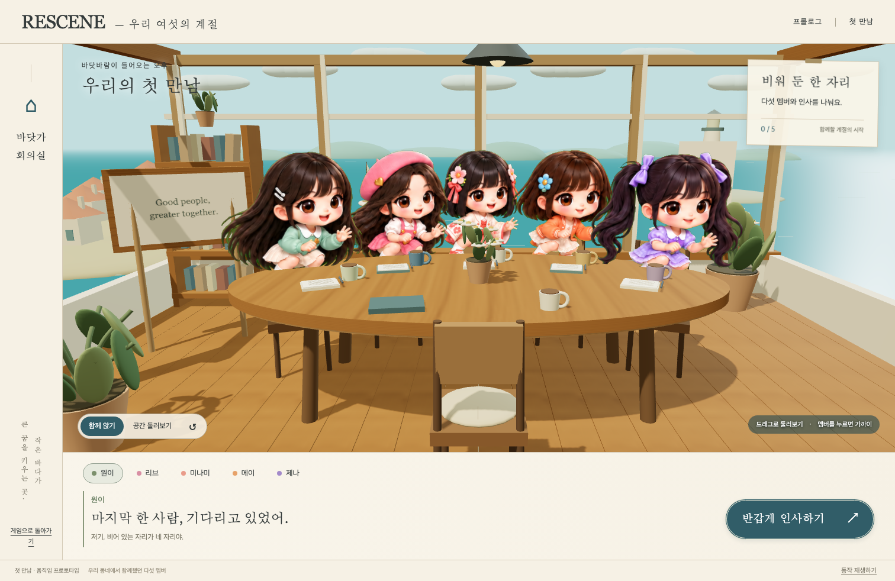
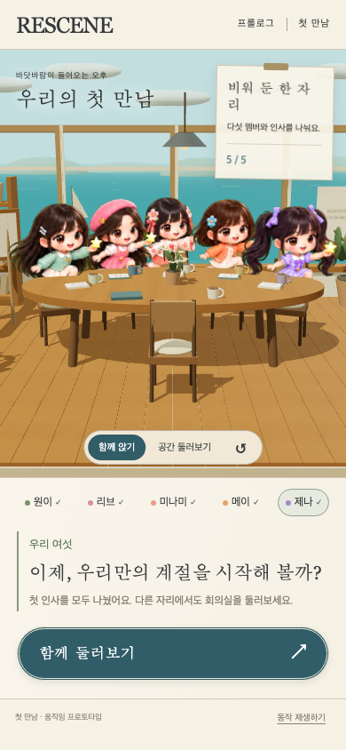
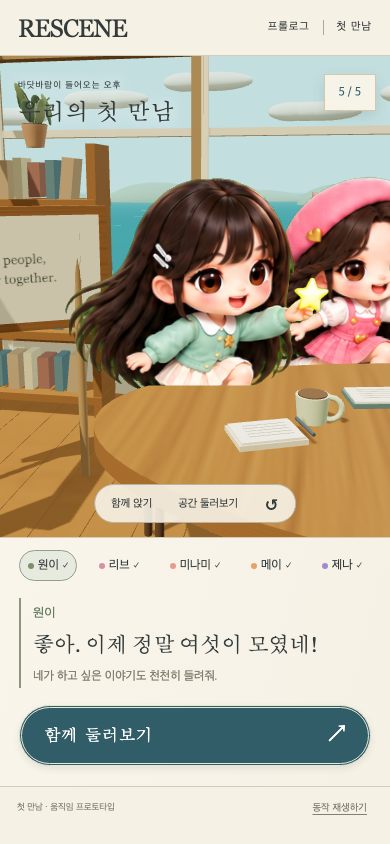

# 첫 만남 — 기존 동네 캐릭터 적용

사용자가 기존 심시티형 동네 게임에서 사용하던 캐릭터를 선택했다. 첫 만남 장면의 원이·리브·미나미·메이·제나 전원을 그 디자인으로 교체했다. 앞선 절차적 인형과 Vivi VRM 후보는 현재 장면에서 사용하지 않는다.

## 실제 화면

## 원본과 표현 방식

- 기존 프로젝트의 `public/assets/dolls/rescene-motion-v2.webp`를 수정 없이 복사했다. 승인된 `rescene-dolls-v1` 디자인의 기존 추가 포즈 아틀라스이며 새 캐릭터 생성이나 얼굴·의상 재디자인은 하지 않았다.
- 원본 위치: `/Users/admin/workSpace/rescene-game/public/assets/dolls/rescene-motion-v2.webp`.
- 원본·적용본 공통 SHA-256: `0fcbab7508f37b76bdf5441d37330bfcf802e4b73fac8ff489aa17679ac67952` (1,633,080 bytes).
- 기존 로더와 같은 색 키 기준으로 브라우저의 텍스처 캐시에서 초록 배경만 제거한다. 원본 파일은 보존한다. 각 멤버는 기존 두 포즈를 사용한다.
- 방·탁자·소품·카메라는 실제 Three.js 3D다. 캐릭터는 카메라 쪽을 향하는 이미지 평면이다. 측면·뒷모습을 갖춘 3D 모델이나 연속 관절 애니메이션으로 표현하지 않는다.
- 캐릭터는 원본에 포함된 명암을 유지하며, 방의 조명으로 얼굴 색을 다시 바꾸지 않는다. 같은 픽셀 배율과 머리 윗부분 기준점을 사용해 포즈를 바꿀 때 크기가 튀지 않도록 한다.

## 동작

다섯 멤버 선택, 확대, 인사 포즈 전환과 원래 포즈 복귀, 호흡과 작은 흔들림, 카메라 드래그·키보드·터치, 일시정지와 reduced motion을 연결했다. 이미지의 투명 여백은 클릭 대상으로 잡지 않고, 탁자처럼 앞을 가리는 물체도 클릭 판정에 반영한다. 확대 화면은 안내 카드를 축소해 얼굴을 가리지 않게 했다.

파일 로딩 실패 시 재시도 안내를 표시한다. VRM 로더·모델 정적 경로를 현재 서버에서 제거했으며 blob CSP 예외도 제거했다. 기존 게임의 저장·AI 호출과 분리된 미리보기다. 앞선 VRM 및 절차적 GLB 파일·제작 도구는 과거 실험 기록으로 남아 있으며 현재 화면에서는 내려받지 않는다.

## 검증

[브라우저 검증 원본](3d-original-dolls/verification.json)과 위 캡처를 함께 보관한다. 기존 survival 테스트 45개, 변경 JavaScript ESLint와 git diff --check를 확인했다. 최종 Chromium·WebKit E2E 모두 통과했다.

- 다섯 캐릭터 표시·투명 여백 클릭 제외·기본/인사/복귀 포즈·이미지 로딩 오류·카메라·드래그·키보드·터치·390px 모바일·일시정지·reduced motion·GPU 실패 복구를 검증했다.
- 최초 전체 화면: 94,377 triangles / 80 draw calls. 이전 VRM 혼합 후보의 497,563 / 340보다 감소했다. 실제 모바일 기기 FPS 측정은 수행하지 않았다.
- 앱 오류·외부 네트워크·AI API 호출 0. 기존 테스트 저장 파일 바이트 보존, 두 HTML의 CSP에 blob 예외가 없는 것과 이전 VRM 경로가 404인 것 확인.
- WebKit 스크린샷 도구의 스타일 주입에 따른 CSP 진단 6건은 앱 오류와 분리해 원본 결과에 기록했다.
- 실제 4321 미리보기에서도 `original-town-dolls`, 멤버 수 5와 모바일 메이 선택·인사 포즈를 확인했다.

## 반영 위치

로컬 미리보기: http://127.0.0.1:4321/survival-3d.html — 멤버 버튼으로 확대하고 인사할 수 있다.

구현 브랜치: `feat/survival-3d-first-meeting-20260929`, [PR #4](https://github.com/hhj4861/rescene-game/pull/4). 작업 브랜치와 로컬 미리보기 반영이며 머지·운영 배포는 별개다. 본 문서가 앞선 `3d-avatar-replacement.md`의 VRM 교체 후보 기록을 대체하는 현재 화면 설명이다.
