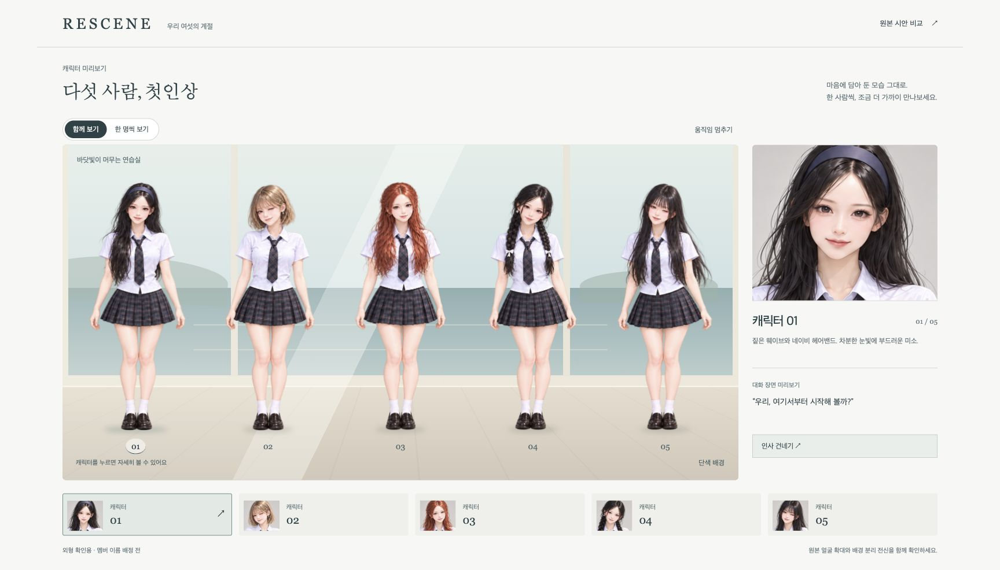
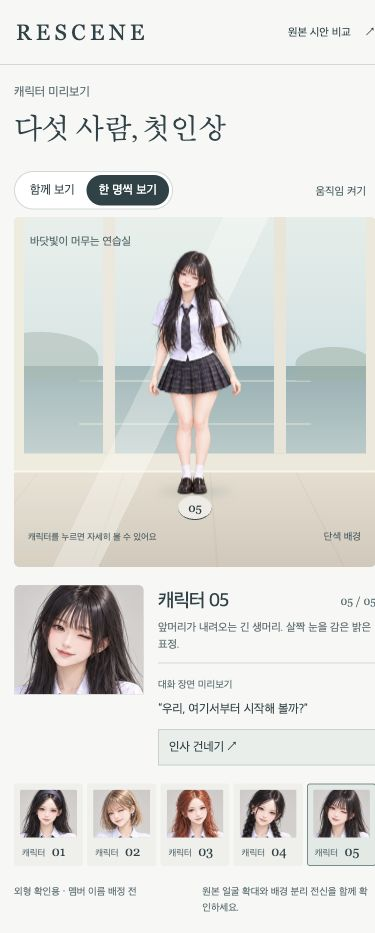

# 2.5D 캐릭터 외형 확인

2026-09-29 · `feat/character-25d-review-20260929`

사용자가 승인한 `cast-lineup-v1.png`를 기준으로, 다섯 캐릭터의 외형을 먼저 확인하는 별도 화면을 구현했다. 사용자 요청에 따라 이름은 배정하지 않고 시안 순서 01–05를 사용한다. 본게임 캐릭터 교체와 기준 브랜치 머지는 아직 하지 않았다.

## 화면과 실행

- 경로: `/character-review.html`
- 로컬 확인: http://127.0.0.1:4322/character-review.html
- 함께 보기 / 한 명씩 보기, 전신 클릭과 얼굴 목록 선택, 원본 비교 모달.
- 좌우 방향키·Home·End로 캐릭터 선택. 모달은 Escape로 닫히고 버튼으로 포커스 복귀.
- 바닷가 / 단색 배경, 호흡을 표현하는 미세한 움직임, 포인터에 따른 배경과 캐릭터의 시차.
- 움직임 정지와 `prefers-reduced-motion` 지원. 정지 버튼은 CSS 애니메이션과 포인터 시차를 함께 멈춘다.
- 인사는 캐릭터별 고정된 예시 대사다. AI 호출·시즌 생성·게임 저장 변경을 하지 않는다.

작업 worktree에서 실행한다. 기존 4317·4321 서버와 다른 저장 폴더를 사용한다.

```sh
node --input-type=module -e 'import {startServer} from "./server/survival/server.mjs"; startServer({port:4322,dataDir:"/tmp/rescene-character-review-20260929"});'
```

## 아트와 범위

- `public/assets/characters25/reference.png`: 승인한 원본을 그대로 복사. SHA-256 일치 확인. 얼굴 확대·하단 선택 이미지·비교 모달은 이 파일을 직접 표시한다.
- `public/assets/characters25/cast.png`: 내장 imagegen의 배경 분리 편집으로 만든 RGBA 1774×887 전신 아틀라스. 알파 0–255 확인. 생성형 편집이므로 원본과 픽셀 단위로 동일한 전신은 아니다.
- 전신의 다섯 영역을 별도 SVG clipPath로 분리하고 같은 논리 너비로 표시한다. 좁은 화면에서도 옆 캐릭터가 섞이거나 체격이 다르게 확대되지 않는다.
- 정확한 편집 프롬프트와 출처: `public/assets/characters25/provenance.json`.
- 얼굴·눈·입을 분리한 리깅이나 새로운 표정·포즈 애니메이션은 이번 범위에 없다. 현재 2.5D는 투명 캐릭터 이미지, 바닥 그림자, 배경 시차와 미세한 전체 움직임으로 구현했다.
- Tripo 결과물·유료 내보내기는 사용하지 않았다.

## 디자인

바닷가 연습실에서 캐릭터를 가장 크게 보여주고 오른쪽에는 원본 얼굴을 배치했다. 배경은 해무 `#dce8e6`, 바다 `#789aa1`, 모래 `#e7dfd0`, 종이 `#f7f8f4`, 글자 `#2c4248`을 사용한다. 제목은 바탕 계열, 조작부는 시스템 고딕으로 구분했다. 장식 카드 대신 한 장면과 선택한 얼굴에 집중한다. 모바일에서는 얼굴과 설명이 장면 아래로 이동한다.

## 검증

- Chrome 실제 브라우저에서 01–05 선택과 제목·선택 상태 동기화 확인.
- 인사 대사 변경, 캐릭터별 인사 상태 분리 확인.
- 개별 보기에서 한 명만 표시, ArrowRight 순환과 End 이동 확인.
- 움직임 정지 시 computed `animationPlayState: paused` 확인.
- 원본 모달 열기·Escape 닫기 확인.
- 390×844 모바일에서 전신 5명의 크기·발 위치 정렬, 가로 넘침 없음, 개별 보기 확인.
- 앱 콘솔 오류 없음. 브라우저 확장 프로그램 경고는 앱 오류와 분리했다.
- HTML·JS·CSS·이미지 2개, 총 5개 정적 경로 HTTP 200 확인.
- 기존 서버 회귀 테스트 1/1 통과, 변경 JS ESLint·구문 검사·diff 검사 통과. 서버 테스트의 최초 sandbox 포트 제한은 승인된 실행에서 재검증했다.




