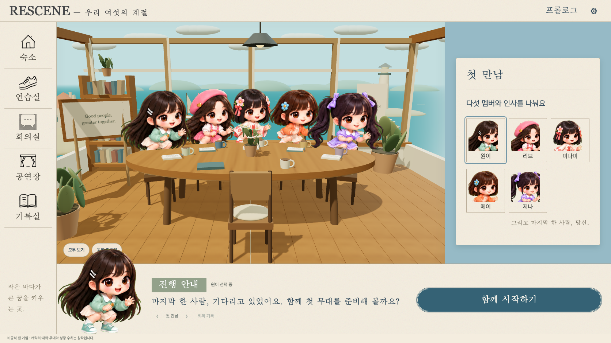
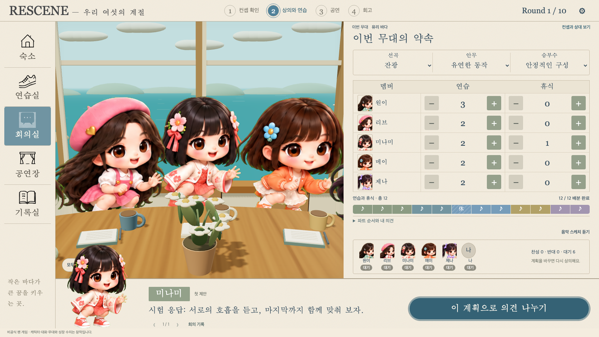
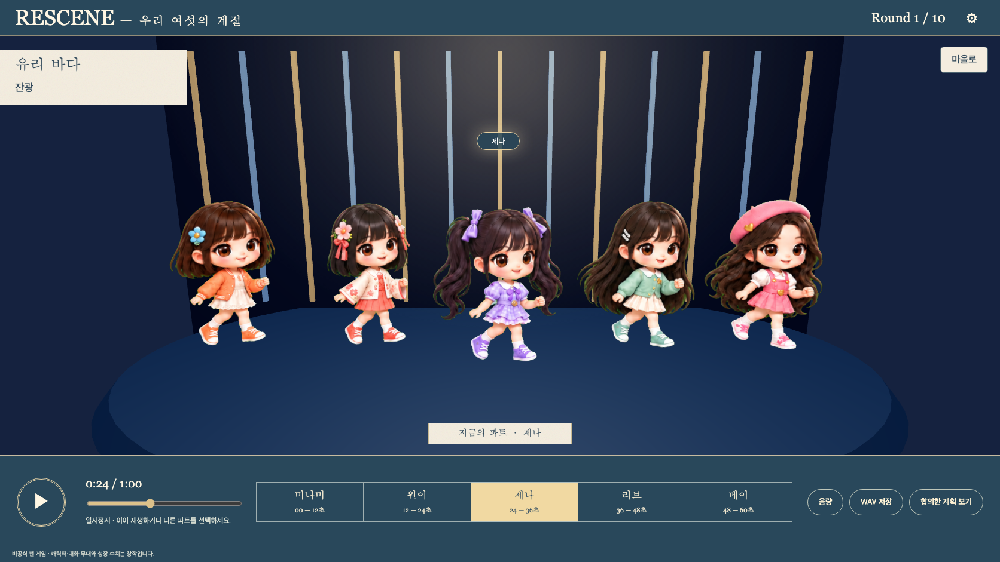
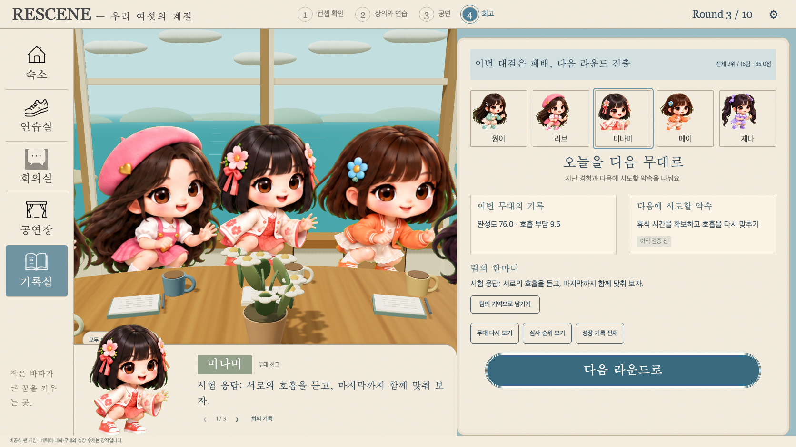
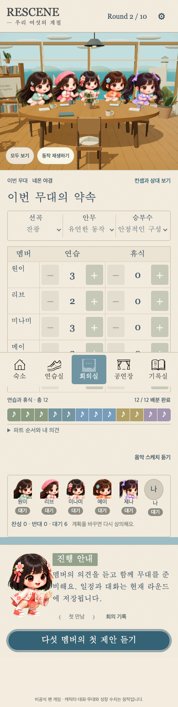

# 기존 캐릭터와 실제 시즌 플레이 연결

2026-09-29. 구현 브랜치 `feat/survival-3d-first-meeting-20260929`, PR #4. 작업 브랜치의 기능 구현이며 기준 브랜치 머지·운영 배포는 별도다.

## 적용 범위

`/`, `/survival.html`, `/survival-3d.html`에서 기존 생존 게임 엔진을 그대로 사용한다. 기존 첫 만남 전용 미리보기는 `/survival-3d-preview.html`로 옮겼다.

- 시즌 생성 → 12 PP 계획 → 멤버 제안·토론·투표 → 공연 → 심사·회고 → 다음 라운드 → 10라운드 결말을 같은 캐릭터 화면에서 진행한다.
- 캐릭터 선택은 해당 멤버의 실제 저장된 응답을 보여준다. 모델 호출·실패 멤버 재시도·반대 후 재토론·기억·저장 복원은 기존 API와 엔진을 재사용한다.
- 기존 다섯 멤버 아틀라스를 회의실·무대·프로필에 사용한다. 3D 공간 안의 2.5D 이미지 캐릭터이며 관절이 있는 전신 3D 모델은 아니다. 원본 아틀라스 파일은 수정하지 않았다.
- 공연의 파트·센터·캐릭터 위치를 기존 오디오 재생 시간 및 탐색 위치에 연결했다. 합의한 계획으로 생성하는 기존 60초 오디오와 WAV 내보내기를 유지한다.
- 상태 갱신과 장면 이동에도 하나의 WebGL 캔버스를 재사용한다. 그래픽 초기화 실패 시에도 게임 입력은 사용할 수 있다.
- 시작 전 상태 조회가 시즌 이름 초안을 지우던 문제와 시작 버튼 중복 제출을 수정했다.

## 검증

- `node --test tests/survival/*.test.mjs`: 45/45 통과.
- `node tools/survival/verify-approved-ui.mjs`: 명시적 fixture 응답 300회로 10라운드 전체 흐름 통과. 저장 복원, PP 제한, 공연 탐색·오디오·WAV, 모바일 및 WebKit 확인.
- `node tools/survival/verify-playable-world.mjs`: fixture 응답 41회. 시작 초안 보존·중복 제출 방지·실패 멤버만 재시도·캐릭터와 응답 연결·반대 후 재토론·캔버스 재사용·공연 동기화·저장 복원·모바일 조작·GPU 실패 시 게임 입력 유지 확인.
- `node tools/survival/verify-3d.mjs`: 경로를 옮긴 첫 만남 미리보기 회귀 검증 통과.
- 변경 JavaScript ESLint와 `git diff --check` 확인.
- 아래 화면은 테스트 실행에서 생성했다. 모바일 화면은 컨트롤 가림을 수정한 후의 별도 통합 검증 결과다. 이후 전체 보기/움직임 컨트롤을 오른쪽으로 정렬했으며 실제 로컬 화면에서 클릭을 확인했다.

실제 로컬 `http://127.0.0.1:4321/survival-3d.html`은 기존 비공개 LiteLLM 설정을 읽어 AI 구성 여부·시작 버튼 활성화·다섯 캐릭터 렌더링을 확인했다. 이 확인에서는 시즌을 생성하거나 실제 모델을 호출하지 않았다. 전체 시즌 AI 응답 검증은 fixture 기반이다. 4321 저장 위치는 `/tmp/rescene-3d-preview-20260929`이며 기존 4317 서버와 사용자 저장 데이터는 변경하지 않았다.

## 실행 화면

검증 결과: [verification.json](playable-character-world/verification.json)
