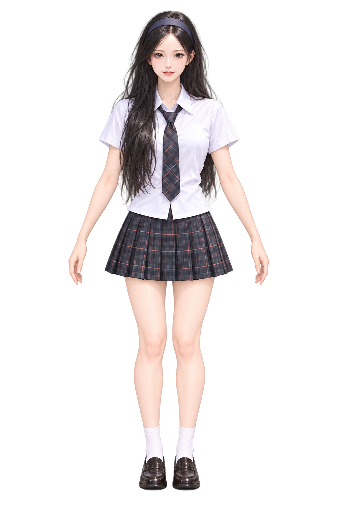

# 첫 캐릭터 3D 제작 준비

2026-09-29. 바닷가 의상 v2의 3D 생성 준비를 재개했다. 실제 모델 생성은 아직 완료되지 않았으며 Tripo 경로가 필수인지 사용자가 질문하여 해당 작업을 멈추고 제작 경로를 재검토한다. 교복 입력은 사용하지 않는다.

## 현재 방향

Tripo는 필수 의존성이 아니다. 사용자가 반복되는 업로드 문제 이후 Tripo를 꼭 사용해야 하는지 질문했다. 선택한 서비스의 절차보다 시안에 맞는 실제 3D 캐릭터 제작이 목표다. Tripo 생성은 제출하지 않았고 유료 결제도 없었다. 추가 업로드 요청을 이어가지 않는다.

대안은 Blender에서 직접 모델링하거나 적합한 이용 권한을 갖춘 캐릭터 베이스를 수정하는 방식이다. 어느 방식도 시안의 외형을 자동 보장하지 않으며 한 명의 실제 모델을 여러 각도에서 확인해야 한다. 이 기록 시점에는 Blender 설치·기초 모델 확보·실제 메시 제작을 완료하지 않았다. 아래 서비스 접속 기록은 시도 내역으로 보존한다.

## 재개 상태 — 바닷가 의상 v2

사용자의 계속 요청으로 새 의상 방향의 첫 캐릭터 변환을 재개했다. [새 단독 입력 이미지](coastal-model-input-v2.png)와 [생성 프롬프트](coastal-model-input-v2-prompt.txt)를 준비했다. 내장 image_gen으로 만든 정면 전신 PNG이며, 시안의 세이지 니트·아이보리 블라우스·청록 계열 긴 스커트·갈색 신발을 유지했다. 이미지는 생성 원본을 그대로 복사했다.

Tripo Studio에서 로그인 완료 및 무료 크레딧 200개를 확인했다. 초기 안내의 게임 에셋·캐릭터·개인 창작자 유형을 선택하고 유료 업그레이드 화면을 닫았다. 무료 내보내기 제한을 고려해 AI 모델을 H2.5로 선택했으며 생성 버튼은 40크레딧을 표시했다. 유료 옵션을 켜지 않았다.

이미지 파일 선택 이후 자동 업로드가 Chrome 확장의 파일 URL 접근 권한 부족으로 실패했다. 사용자가 파일 URL 접근을 허용했다고 응답한 뒤 다시 시도했지만 확장은 동일한 접근 오류를 반환했다. 확장 설정 페이지 확인도 브라우저 URL 보안 정책으로 거부됐다. 다른 경로로 설정을 우회하지 않고 사용자에게 Tripo 왼쪽 이미지 입력에 파일을 직접 선택하도록 요청했다. 사용자가 이미지 선택 완료라고 응답했지만 실제 화면에는 미리보기가 없었다. 자동 파일 선택을 시도하지 않은 새 작업 탭을 열고 H2.5를 다시 선택한 뒤 직접 입력을 요청했다. 크레딧 200개를 확인했으며 생성 제출은 하지 않았다. 실제 모델이나 GLB 파일은 아직 없다.

작업 화면: https://studio.tripo3d.ai/ko/workspace/generate

## 이전 준비 기록 — 교복 입력 (사용하지 않음)

[character-01-model-input.png](character-01-model-input.png)는 01 시안에서 만든 단독 정면 전신 이미지다. 내장 image_gen으로 배경·문구·다른 각도를 제거하고 팔을 몸통에서 떨어뜨린 중립 자세로 구성했다. PNG RGBA 1024×1536, 모서리 alpha 0이며 알파 채널이 존재함을 확인했다. 모든 불투명도 최대값은 254로 출력되어 원본을 그대로 보존했다. 원본 색상이나 알파를 별도 스크립트로 보정하지 않았다.

전체 프롬프트: [model-input-prompt.txt](model-input-prompt.txt). 이 파일 자체는 2D 입력 자료이며 메시·리깅·GLB가 아니다.

## 확인한 제작 경로

- 현재 호출 가능한 도구 및 플러그인 검색에서 연결 가능한 전용 3D 생성 기능을 찾지 못했다. 기본 /Applications 목록에 Blender도 없었다.
- Meshy 공식 웹사이트는 현재 Chrome에서 ERR_CERT_AUTHORITY_INVALID로 열리지 않았다. 보안 경고를 우회하지 않았다.
- Tripo Studio의 실제 제작 화면은 열렸으며 가입/로그인 버튼이 보인다. 로그인되지 않은 상태다. 생성 이미지를 업로드하거나 모델 생성을 제출하지 않았다.
- 사용자가 Tripo 로그인 후 무료 변환을 허용했다. 이어 기존 의상이 게임에 어울리지 않는다고 수정 요청하여 변환을 보류했다. 로그인 상태 재확인 도구 호출은 사용자에 의해 중단됐다. 계정 생성, 이미지 업로드, 모델 생성, 결제, 유료 구독 또는 모델 공개를 실행하지 않았다.

[Tripo 공식 요금 안내](https://www.tripo3d.ai/pricing)에 따르면 무료 플랜은 공개·비상업용이며 모델·내보내기 제한이 있다. 따라서 무료 결과는 먼저 외형 검증 용도로만 사용한다. 게임 배포용 라이선스와 다운로드 가능 여부는 실제 선택한 모델·계정 화면에서 별도로 확인한다.

[Meshy 무료 플랜 안내](https://help.meshy.ai/en/articles/15696428-what-is-included-on-the-free-plan)는 Meshy 6 Lite 월 10회 다운로드와 유료 모델 다운로드 제한을 구분한다. 모든 모델이 무료로 다운로드된다고 가정하지 않는다.

## 실제 생성 후 검증할 항목

1. 정면 얼굴·머리 비율과 헤어밴드를 시안과 비교한다. 양쪽 측면·후면으로 회전하여 이미지 평면이 아닌 입체 메시인지 확인한다.
2. 머리·손·팔·옷이 서로 붙거나 관통하지 않는지 확인한다. 생성된 머리카락은 시안과 동일한 개별 모발을 보장하지 않으므로 측면 실루엣을 확인한다.
3. 게임 적용 전에 적절한 이용 권한과 GLB 내보내기를 확보하고 텍스처 포함 여부를 검사한다.
4. 애니메이션용 골격과 관절 변형을 확인한 뒤 회의실 착석·무대 자세에서 비교한다. 고정 포즈 모델 생성만으로 애니메이션 구현 완료라고 보지 않는다.

현재 게임 실행 코드와 캐릭터 자산은 변경하지 않았다. 완성된 3D 모델 파일도 아직 없다.
