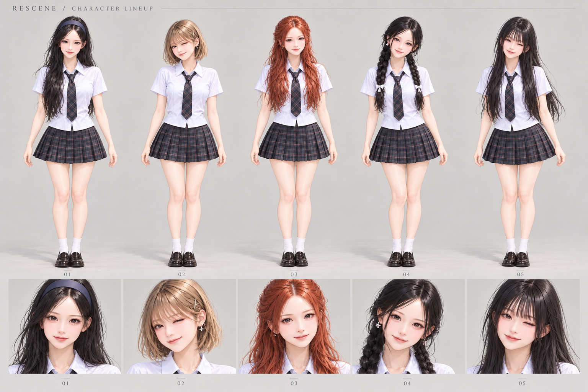
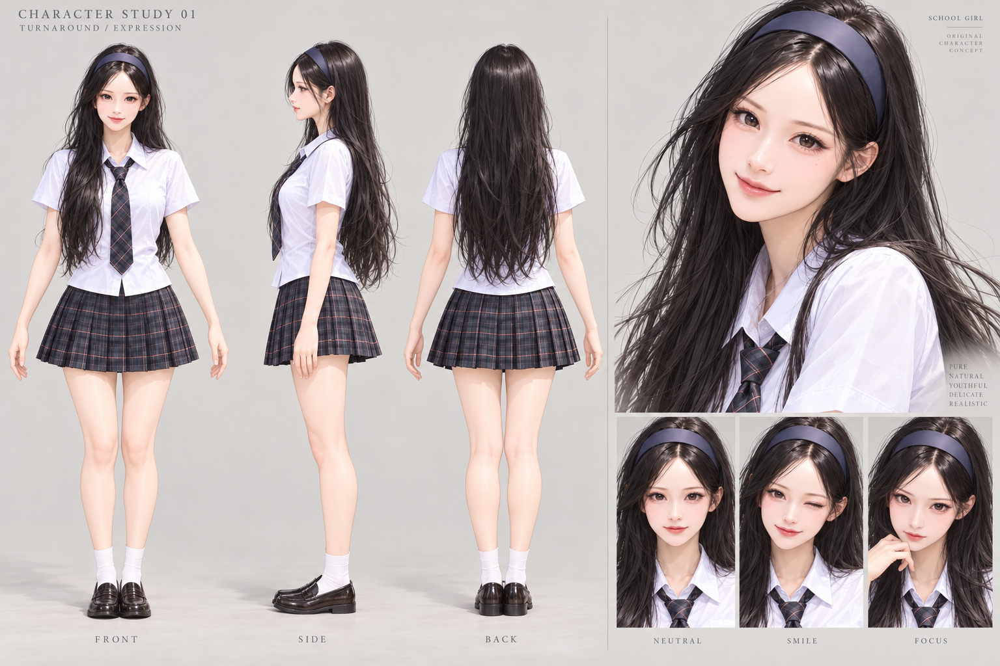

# 반실사 캐릭터 디자인 시안

2026-09-29. 사용자 제공 썸네일을 참고해 대표 캐릭터를 제작한 뒤, 같은 표현으로 다섯 캐릭터를 확장했다. 이 폴더는 디자인 문서이며 게임 런타임에는 연결하지 않았다.

## 시안

번호는 [참고 영상](https://youtu.be/DMyVxaF-U1Y)의 썸네일 왼쪽부터 보이는 순서다. 이미지 외형만으로 실존 멤버 이름을 판정하지 않았으며 게임의 멤버 ID와는 아직 연결하지 않았다. 원본 썸네일의 AI 제작 여부도 확인되지 않았다.

| 번호 | 유지할 외형 |
| --- | --- |
| 01 | 긴 검은 웨이브, 넓은 남색 헤어밴드, 부드러운 인상 |
| 02 | 밝은 애쉬 계열 단발, 옆으로 흐르는 앞머리, 작은 머리핀 |
| 03 | 구리빛 긴 웨이브, 관자놀이 부근의 작은 땋은 머리 |
| 04 | 검은 양갈래 땋은 머리, 흰 리본, 얼굴 옆 잔머리 |
| 05 | 앞머리 있는 긴 검은 생머리, 헤어밴드 없음 |

## 제작 기준과 현재 상태

- 얼굴과 머리 크기는 첫 시안의 자연스러운 비율을 유지한다. 큰 머리·구슬 같은 눈·장난감 재질로 다시 단순화하지 않는다.
- 흰 반소매 셔츠, 어두운 체크 타이와 플리츠 스커트, 흰 양말과 어두운 로퍼로 의상을 통일했다.
- 다섯 명 모두 전신과 얼굴 비교 시안이 있다. 정면·측면·후면 및 표정 시트는 01만 제작되어 있다. 나머지 네 명의 측면·후면은 아직 없다.
- 생성 이미지는 시각적 디자인 참고 자료다. 치수·옷 주름·눈 상태는 모델링 전 정리해야 한다. 02·05에는 윙크가 있으므로 중립 얼굴 제작 자료에서는 양쪽 눈을 뜬 모습이 추가로 필요하다.
- 실제 메시, UV, 텍스처 세트, 관절, 표정 블렌드셰이프, GLB/VRM, 애니메이션은 아직 제작하지 않았다. 이미지가 3D 모델로 자동 변환되었다고 보지 않는다.

다음 제작 단계는 01을 실제 3D 모델로 만든 뒤 정면뿐 아니라 측면·후면, 회의실 착석과 무대 조명에서 외형을 검증하는 것이다. 현재 연결된 3D 생성 서비스나 사용할 기초 모델은 확인되지 않았다. 나머지 네 명으로 모델 작업을 확대하기 전에 이 한 명의 품질을 확인해야 한다.

## 생성·검증

내장 image_gen 도구를 사용했다. 외부 CLI/API fallback은 사용하지 않았다. 전체 프롬프트는 [prompts.json](prompts.json)에 저장한다. 참고 썸네일과 첫 시트를 입력으로 사용해 같은 표현을 유지했다.

생성 결과를 직접 확인해 다섯 전신·다섯 얼굴, 번호와 머리 모양의 대응, 신발까지 포함한 구도, 01의 세 방향 및 표정을 검토했다. 이 확인은 이미지 검토이며 3D 런타임 성능·메시·리깅 테스트가 아니다. 원본 생성 파일을 변경하지 않고 복사했으며 기존 게임 캐릭터 자산과 실행 코드는 수정하지 않았다.
