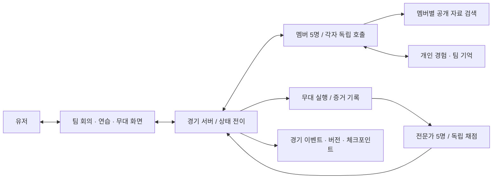

# RESCENE SURVIVAL — 독립 에이전트와 경험 성장 설계

작성: 2026-09-19 / 담당: Codex / 상태: Claude 분담 수락·1차 교차 검토 수신, 수정안 상호 검토 중. 구현·모델 학습·운영 적용 없음.

## 1. 제품 목표와 범위

플레이어와 미나미·원이·제나·리브·메이 에이전트가 여섯 명의 팀을 이루어, 대화로 무대를 만들고 20팀 서바이벌의 10라운드를 경험한다. 다섯 멤버는 각각 독립적으로 제안·반론·합의·수행·회고하며 다음 라운드에서 경험을 활용한다. 사용자는 팀원이며 모든 멤버의 판단을 대신하는 운영자가 아니다.

이번 작업은 요구 분석, 데이터/실행 계약, 성장 및 검증 설계까지다. 기존 동네/아케이드 삭제, 실제 모델 호출, 대량 자료 수집, 배포, 구현 트랙 실행은 포함하지 않는다. 예시의 멤버 대사와 능력 수치는 게임 창작이며 실제 인물의 생각·능력을 단정하지 않는다.

| 요구 | 설계 결정 | 확인 방법 |
| --- | --- | --- |
| 유저와 멤버 다섯이 한 팀 | 유저도 제안·투표·질문 참여. 각 멤버의 동의/유보를 표시 | 유저 제안이 회의와 무대 계획에 반영되는 E2E |
| 각 멤버가 독립 LLM | 멤버별 호출, 컨텍스트, 메모리, 실행 식별자 분리 | 한 호출이 다른 멤버의 의견을 대필하지 않는 추적 |
| 공개 자료에 근거한 멤버 | 출처·발언자·시간을 보존한 자료 묶음과 검색 | 다른 멤버 오귀속, 근거 없는 성격 단정 검사 |
| 라운드마다 성장 | 무대 증거 → 개인 회고 → 전략 가설 → 다음 행동 → 재검증 | 기억 유무 비교 및 두 라운드 인과 검사 |
| 20팀·10라운드·자동 컨셉 | 경기 규칙은 결정적 코드, 컨셉은 시드 기반 카탈로그 선택 | 정확한 팀 수/라운드 수/재시작 동일성 |
| 전문가 다섯 독립 심사 | 5개 심사 호출과 별도 문맥, 점수 봉인 후 공개 | 다른 심사위원 점수와 팀 비공개 회의 접근 불가 |
| 음악·안무·파트를 팀이 결정 | 실행 가능한 구조화된 무대 계획과 역할별 수행 | 계획과 실제 수행 이벤트 대조 |

## 2. 현재 프로젝트 분석

분석 대상은 `/Users/admin/workSpace/rescene-game`의 현재 작업 트리다. 기준 HEAD는 `2c5c17d78519c3a404cefa8d11ceb8aa2b66b7da`이나 아래 일부 파일은 미커밋 상태다. 따라서 HEAD만으로 현재 게임 전체가 재현된다고 주장하지 않는다.

- `src/main.ts`: `?mode=arcade` 또는 환경변수면 아케이드, 나머지는 `src/sim/app`의 동네 게임을 실행한다.
- `package.json`: TypeScript/Vite/Phaser/Capacitor/Zod 기반. 현재 선언된 의존성에 LLM SDK나 서버 프레임워크가 없다.
- `src/sim/storage.ts`: 로컬 저장과 Capacitor Preferences 백업. 현재 게임 저장 보호 방식은 참고하되 서버의 경기·에이전트 기억 권한으로 재사용하지 않는다.
- `src/data/storySources.ts`, `docs/design/youtube-story-sources.md`: 멤버별 영상/기사 URL과 일부 구간 요약이 있다. 이 분석에서 영상 전체나 요약의 사실을 재검증한 것은 아니다. 인물 코퍼스의 후보 목록으로만 편입한다.
- `src/data/characterVoices.ts`: 기존 창작 음성 연출 설정. 실제 성격·말투의 학습 데이터로 자동 승격하지 않는다.
- `src/scenes/CodexScene.ts`의 Codex는 게임 도감 명칭이다. OpenAI Codex 연동이 아니다.
- 기존 미완료 변경과 인덱스를 건드리지 않기 위해 설계는 독립 worktree/브랜치에서 작성한다. 현재 미커밋 게임 소스를 이 브랜치에 복사하지 않는다.

권장 접점은 향후 `?mode=survival`의 별도 진입점이다. 기존 저장 키를 재사용하지 않고 새 시즌 데이터는 별도 네임스페이스에 둔다. 통합 시점에 실제 기준 브랜치와 변경 소유권을 다시 확인한다.

## 3. 구성과 책임



- **멤버 에이전트 5개:** `minami`, `woni`, `zena`, `liv`, `may`. 이름만 바꾼 한 번의 응답이 아닌 각자 실행이다. 기반 모델은 같아도 되며 모델/제공사는 설정으로 선택한다. 문맥과 기억을 분리하는 것이 독립성의 기준이다.
- **심사위원 에이전트 5개:** 가상 보컬 디렉터, 안무가, 음악 프로듀서, 무대 연출가, 종합 공연 심사위원. 역할별 평가 관점은 다르되 같은 점수 척도와 공통 증거를 사용한다.
- **경기 서버:** 턴 진행, 참가 자격, 파트 배분 검증, 연습 자원, 실행, 점수 집계, 탈락, 저장의 단일 기록자. LLM은 결과 제안만 제출하며 DB나 승패를 직접 수정하지 않는다.
- **자료 처리:** 게임 플레이와 분리된 수집/검수 작업. 경기 중 임의 웹 검색 결과로 인물 설정을 바꾸지 않는다.
- **상대 19팀:** 팀 정체성과 자원·전략을 가진 참가자. 초기에는 규칙 기반 계획 생성으로 시작하되 같은 무대 실행기와 같은 심사 절차를 거친다. 상대도 모두 5개 LLM을 갖는 것은 현재 사용자 요구에 포함되지 않은 확장이다.

경기 진행은 코드로 제어한다. 별도 사회자 LLM이 필요해져도 안내만 맡고 멤버 의견·투표·심사평을 대필하지 않는다.

## 4. 팀 회의와 사용자 권한

1차 교차 검토를 반영한 프로토콜(호출 예산·심사 일괄 처리의 최종 문서 정합 검토 중):

1. 동일한 라운드 공지와 팀 공개 상태를 다섯 멤버에게 주고, 각자 첫 제안을 독립 작성한다. 먼저 말한 멤버의 의견에 나머지가 무조건 끌려가는 것을 줄인다.
2. 제안을 모두 공개하고 유저가 질문·대안·우선순위를 낸다. 멤버는 타인의 제안을 읽고 근거를 들어 수정하거나 반대한다. 매번 강제 갈등을 만들어내지는 않는다.
3. 계획 버전을 만든 뒤 유저와 다섯 멤버가 동일 버전에 한 표씩 의사를 표시한다. 기준은 4/6 동의이며 유보와 반대 이유를 남긴다. 3:3이면 쟁점만 재토론한다. 유저가 반대했는데 4/6이 성립하면 라운드당 1회 재토론을 보장하고 다시 투표한다. 추가 토론 예산 중 1회를 이를 위해 예약한다. 재토론은 유저 대신 동의하거나 게임을 강제 진행하는 장치가 아니다.
4. 합의 여부와 별개로 실제 무대 시작은 사용자의 명시적 버튼 입력을 기다린다. 이는 플레이 진행 제어이며 유저에게 추가 표를 주는 것이 아니다. 유저의 침묵을 찬성으로 처리하지 않는다. 재토론 뒤에도 시작하지 않으면 정상적인 사용자 보류 상태로 유지한다.
5. 기계적 제약 위반(없는 파트·예산 초과·동일 시간 불가능한 동작)은 투표 결과와 관계없이 반려한다. 합의된 뒤 계획이 바뀌면 이전 동의는 새 버전에 승계하지 않는다.

발언 횟수와 모델 호출 예산이 끝나면 합의 미완료 상태로 멈추고, 유저에게 쟁점과 재개 선택을 제공한다. 임의 계획으로 무대에 진입하지 않는다. 자유 대화는 가능하지만 판정에 반영되는 것은 구조화된 제안과 수락된 계획이다. 연습 포인트 배분도 합의 계획에 포함하며, 대기 중 수정은 다음 버전의 제안으로만 저장한다. 진행 중인 호출의 입력 상태를 바꾸지 않는다.

## 5. 공개 자료 기반 인물 설정

초기 방식은 인물별 자료 검색(RAG) + 출처 기반 설정 + 게임 경험 기억이다. 매 라운드 모델 가중치를 재학습하는 방식은 선택하지 않는다. RAG는 질문과 관련된 자료를 골라 모델 입력에 제공하는 기법이다. [Anthropic Contextual Retrieval](https://www.anthropic.com/engineering/contextual-retrieval)

자료 흐름: 후보 URL 등록 → 확보 가능한 자막/인터뷰 텍스트 → 발언자·시간 구간 확인 → 근거 단위 요약 → 검수 → 멤버별 색인 → 버전 고정.

`SourceRecord`: `sourceId`, `url`, `title`, `channel`, `publishedAt`, `retrievedAt`, `memberIds`, `speakerId`, `startMs/endMs`, `language`, `summary`, `evidenceType`, `verificationStatus`, `usageBasis`, `contentHash`.

- 본인 발언/공식 영상, 직접 인터뷰, 2차 기사, 팬 블로그 해석을 구분한다. 블로그의 해석을 본인 발언이나 사실로 바꾸지 않는다.
- 자동 자막의 화자·고유명사·번역이 불명확하면 미확인으로 두고 인물 특성의 근거로 사용하지 않는다.
- 인물 설정의 각 관찰에는 출처와 신뢰도를 붙인다. 일회성 예능 장면이나 과거의 어려움을 영구적인 성격으로 고정하지 않는다.
- 실제 인물 근거와 창작 게임 설정은 별도 필드로 저장한다. 게임의 실패/갈등은 현실의 경력 기록에 들어가지 않는다.
- 첫 품질 목표는 멤버당 서로 다른 상황의 검수 자료 3개 이상과 근거 질문 10개다. 이는 제품의 검수 목표이며 실제 인물 재현의 정확성을 보증하는 수치가 아니다. 부족하면 부족한 상태를 표시한다.
- 출처 정정/제거 시 해당 자료를 쓰는 설정·요약·검색 인덱스를 함께 무효화한다. 전문·영상·음원을 무조건 복제하지 않고 확보한 이용 범위와 메타데이터를 기록한다.

기존 자료 요약은 재검수 대기 상태로 가져온다. 현재 다섯 인물의 자료 학습이나 페르소나 검수가 끝난 상태는 아니다.

## 6. 라운드별 경험 학습과 성장

### 기억의 층

| 저장 영역 | 내용 | 쓰기 규칙 |
| --- | --- | --- |
| 인물 근거 | 검수한 공개 자료·프로필 버전 | 자료 검수만 변경, 경기 회고로 수정 불가 |
| 개인 경험 | 자신의 제안, 수행, 관찰, 후회/선호 | 해당 에이전트의 회고 제안을 서버가 검증 |
| 팀 기억 | 공동 합의, 팀 실험, 공유한 교훈 | 공유 이벤트 또는 명시적 팀 합의 필요 |
| 전략 가설 | 조건·행동·예상 효과·반례·신뢰도 | 원본 이벤트 참조가 있는 가설만 저장 |
| 실행 능력 | 게임 내 보컬/리듬/동작 숙련과 피로 | 연습/무대 엔진이 계산, LLM 자가 선언 불가 |

원본 사건 → 구조화된 관찰 → 가설 → 다음 행동 → 새 증거의 순서로 갱신한다. 회고는 모델의 숨겨진 사고 과정이 아니라 게임에 표시할 짧은 근거·개선안이다.

`MemoryRecord`: `memoryId`, `ownerAgentId`, `userId`, `seasonId`, `visibility(private|team)`, `kind`, `eventRefs`, `condition`, `proposedAction`, `expectedEffect`, `confidence`, `status(hypothesis|supported|contradicted|retired)`, `createdRound`, `lastTestedRound`, `revision`, `supersedes`.

예: R2의 후렴에서 고난도 동작과 호흡 실패 이벤트가 함께 관찰됨 → 멤버는 “다음 비슷한 곡에서는 고난도 동작을 간주로 옮기자”는 **가설**을 제안 → R3 계획 변경 → 실제 호흡/리듬 지표로 평가. 한 번의 점수 상승만으로 원인이 입증됐다고 기록하지 않는다.

- 매 라운드 참가한 멤버 전원이 회고할 기회를 가진다. 승리해도 실패/보완점을, 패배해도 효과적이었던 선택을 저장할 수 있다.
- 학습 완료는 회고 요청 성공이 아니라 메모리 커밋까지 성공한 상태다. 중단 후 같은 이벤트를 다시 처리해도 한 번만 적립한다.
- 기억 검색은 멤버·유저·시즌·공개 범위를 먼저 제한한 뒤 컨셉·문제·최신성·신뢰도로 선택한다. 개인 기억 전체를 다른 멤버에게 자동 노출하지 않는다.
- 새 시즌은 새 기억 공간이 기본이다. 플레이어가 선택하면 검증된 일반 전략만 이전 시즌에서 가져오며 패배한 미래 정보가 과거 재시도에 자동 유출되지 않는다.
- 과거 점수의 편향을 학습하지 않도록 심사평과 실행 증거를 분리한다. 모순되는 경험은 삭제해 감추지 않고 가설의 신뢰도를 낮춘다.
- 수치 성장은 범위/감소효용/피로를 엔진이 적용한다. 성장이 매번 승리나 단조로운 점수 상승을 보장하지는 않는다.
- 요약/압축 후에도 중요한 합의, 실패, 근거 링크를 보존한다. 삭제된 근거를 쓰는 요약은 재생성한다.
- 활성 기억 상한은 멤버별 개인 경험 30개, 팀 전체 공유 기억 20개, 멤버별 활성 전략 가설 10개다. 가설은 개인 경험 30개와 별도 계수하며 요약도 해당 상한에 포함한다. 원본 이벤트는 별도 보존하고 프롬프트에 전부 넣지 않는다.
- 매 라운드 기억 커밋 때 상한 초과를 검사한다. 현재 합의/미해결 의무는 보존하고 낮은 신뢰도·오래된 경험부터 압축한다. 압축안은 기존 회고 호출에서 함께 제안받아 근거 보존을 검증한다. 추가 요약 호출은 기본 예산에 숨기지 않는다.
- 가설은 반증되면 contradicted, 대체 가설이 채택되거나 3개 라운드 연속 관련성이 없으면 retired로 보관한다. supported는 후속 증거 검토를 통과한 경우만 가능하다. retired는 기본 검색에서 제외하되 원본·이력을 삭제하지 않는다.
- 한 호출의 기억 검색 기본 상한은 개인 경험 5 + 팀 기억 3 + 활성 가설 2 = 10개, 기억 입력 예산은 4,000토큰 이하다. 초과하면 우선순위에 따라 줄이며 전체 문맥/출력 예산은 별도로 검사한다. 수치들은 초기 실험 설정이며 실측으로 조정한다.
- 유저가 선택하는 팀 교훈은 이미 팀에 공유된 회고의 공용 핀이다. 다른 멤버의 비공개 기억을 공유로 바꾸거나 새로운 팀 합의를 대신 만들지 않는다.

## 7. 경기와 상태 전이

```text
season.created → round.announced → meeting.open → plan.proposed
→ plan.agreed → rehearsal → plan.locked → performance
→ judging → result.published → reflection → learning.committed
→ next round | eliminated | champion
```

- 모든 변경 명령은 `commandId`, `expectedRevision`을 갖는다. 같은 명령 재전송은 동일 결과, 오래된 revision은 충돌 응답을 준다.
- 합의와 연습 후 최종 계획 해시를 고정한다. 계획/동의가 바뀌면 이전 수행 요청은 거부한다.
- 다섯 수행 결과와 심사 다섯 개가 완성되지 않으면 결과를 확정하지 않는다. 회고 실패는 `learning.pending`으로 저장하여 재개하고 다음 라운드로 건너뛰지 않는다. 결과 화면을 읽는 동안 회고를 백그라운드 실행할 수 있지만 learning.committed 전에는 다음 라운드 활성화·회의·자원 소비를 허용하지 않는다. 공지 미리보기는 읽기 전용이다.
- 탈락 라운드에서도 결과·회고·학습은 마친다. 이후에는 관전 또는 새 시즌을 선택한다. 공식 관전도 남은 라운드의 동일한 5인 심사 배치를 실행한다(멤버 호출은 없음). 유저에게 남은 호출 예산을 표시하고 선택을 받은 뒤 진행하며 예산 부족이면 중단한다. LLM 없이 공식 우승자를 임의로 생성하지 않는다. 탈락 팀이 계속 우승 토너먼트에 남는 것으로 처리하지 않는다.

20팀 단판 싱글 엘리미네이션은 10번의 전원 참가 라운드와 맞지 않는다. 다음 변형 토너먼트는 Claude 게임 설계와 채택 방향을 합의했다. 세부 대진 알고리즘은 아래 수정안을 교차 검토한다.

- R1~R9는 1:1 대진 후 패자 중 하위 2팀 탈락: 20→18→16→14→12→10→8→6→4→2.
- R10은 2팀 결승: 1팀 우승. 모든 대진의 승자는 생존하되 일부 패자는 생존하므로 “단판 싱글 엘리미네이션”이라고 부르지 않는다.
- 컨셉은 시즌 시작에 공개 카탈로그의 10개를 시드로 선정·고정하고 라운드마다 공개한다. 재시도로 유리한 컨셉을 다시 뽑지 못하게 한다. 카탈로그는 난이도와 실행 가능성을 검증한다.
- 팀별 절대 점수로 승패를 판정하고 패자 전체를 같은 척도로 정렬한다. 동점은 총점 → 완성도 → 팀워크 → 이전 라운드 총점 → 시즌 시드의 고유 순서로 푼다. R1의 이전 점수는 전팀 0이다. 같은 비교기를 대진 승패와 탈락 순위에 사용한다.
- R1은 시즌 시드 셔플, R2 이후는 직전 순위 인접 매칭이 기본이다. 연속 상대 회피 수정안: 정렬된 목록을 최대 4팀씩 묶어 가능한 완전 매칭을 비교하고, (직전 상대 재대결 수, 순위 차 합, 시드에서 만든 고유 조합 순서)를 사전식 최소화한다. 끝의 2팀은 그대로 매칭한다. 회피 불가능한 재대결은 허용하며 숨기지 않는다. 이는 전역 최적 재대결 회피를 보장하지 않는 제한된 규칙이다.
- 대진·동점·탈락은 버전이 고정된 코드로 처리한다. LLM이 즉흥적으로 대진이나 추가 탈락을 정하지 않는다.

이 안에서 전체 시즌의 공연 수는 110개, 대진 수는 55개다. 중도 탈락한 플레이어는 10라운드를 모두 플레이하지 않을 수 있다.

## 8. 무대 수행과 심사 증거

`StagePlan`: 계획 ID/버전, 컨셉, 사용 가능한 음악 자산 ID·구간, BPM/타임라인, 보컬 파트, 안무 블록, 포메이션, 조명/카메라 큐, 멤버별 과제, 연습 배분, 합의 기록, 잠금 해시. 추가 필드는 `riskMove(none|adlib|danceBreak|unit)`, `practiceAllocation`, `practiceBudget=12`다. 배분의 합계는 12이며 멤버별 최소 1포인트다. 멤버당 최소 한 파트·리드 연속 최대 두 구간을 검사하며 곡/BPM/길이와 포메이션은 검수한 카탈로그 제약을 따른다. 고강도 두 구간 연속은 호흡 경고를 내되 자동 금지 여부는 별도 난이도 설정이다.

초기 프로토타입의 무대는 타임라인 기반 게임 시뮬레이션이다. 각 멤버가 자신의 파트에 대해 `PerformanceIntent`를 제출하고, 실행기가 자원·숙련·피로·고정 시드를 적용해 실제 수행 이벤트를 만든다. 초기 무대는 관전형이며 유저 리듬 조작은 요구하지 않는다. 대화가 음악·안무·파트와 무대 연출을 바꿔야 한다. “잘 불렀다”는 자기평가만으로 성공 이벤트를 만들지 않는다.

`PerformanceEvidence`: 계획 해시, 팀/라운드, 실행 시드, 멤버별 큐 성공/실패·박자 오차·호흡 부담·동선 충돌·관객 반응 모델, 시간별 이벤트, 실제 렌더링된 자산/리플레이 참조, 증거 해시.

오디오/영상 생성 및 실제 가창 분석은 별도 단계다. 텍스트/수치 증거만 전달했다면 UI는 “시뮬레이션 무대 평가”로 표현한다. 실제 음원을 듣거나 영상을 본 심사로 표시하지 않는다.

심사 계약:

- 다섯 심사위원은 같은 고정 증거, 컨셉 공지, 평가표를 받아 독립 채점한다. 팀 비공개 대화, 개인 기억, 다른 심사 점수, 탈락시키고 싶은 대상은 입력에서 제외한다.
- 가상 전문가의 전문성은 역할 설정이며 실제 전문가의 평가로 홍보하지 않는다.
- 라운드 내 기준/모델 버전을 고정한다. 시각/청각 관찰이 없는 항목은 만들어 평가하지 않는다.
- 절대 점수는 완성도·표현·구성·팀워크·임팩트 각 0~20 정수다. 심사위원별 합계는 0~100, 팀 총점은 다섯 합계의 평균이다. 서버는 정수 합계를 비교하고 UI에서만 소수점 한 자리로 표시한다. 역할 차이는 피드백 초점에 반영하며 항목 가중을 몰래 바꾸지 않는다.
- 팀워크 증거는 공개 수행의 동선·전환·파트 협력이다. 비공개 투표 비율·이견·유저 반대 여부는 심사 입력과 점수에서 제외한다.
- **교차 검토 중인 호출 최적화:** 심사위원 한 명이 그 라운드 모든 활성 팀을 각각 절대 채점하는 호출 1회, 총 5회. 팀끼리 상대적인 점수 분배를 하지 않는다. 기존 두 팀 단위 비교안은 철회한다. 유저 대진만 LLM, 나머지는 다른 계산기로 점수를 내는 혼합안도 탈락 순위가 뒤집힐 수 있어 채택하지 않는다.
- `RoundJudgingManifest`는 roundId, 모든 활성 teamId의 정렬된 집합, 팀별 evidenceHash, rubricVersion, 모델 버전, 출력 스키마/토큰 예산을 고정한다. 심사위원별 표시 순서는 기록하고 균형화하되 자료의 내용과 분량 제약은 전팀 동일하다.
- `JudgeBatch`는 judgeId, manifestHash, 팀별 JudgeScore의 완전한 맵이다. 누락·중복 팀, 타 팀 근거, 범위 밖 점수는 거부한다. 출력이 잘리면 부분 점수를 발표하지 않는다. 전체 유효 배치를 한 번만 커밋한 뒤 재호출로 점수를 뽑지 않는다.
- 초기 실험에서 잘못된 일괄 출력은 그 심사위원에 대해 배치 단위 최대 1회만 재시도한다(라운드 총 재시도 예산 내). 계속 실패하면 judging 미완료로 멈추며 팀별 호출로 자동 전환하지 않는다. 20팀 용량·순서 편향 검증 실패로 팀별 모드가 필요하면 시즌 시작 전 또는 라운드 전심사 결과 폐기 후 별도 모드로 선택한다. 모든 팀·심사위원이 같은 모드를 쓰며 추가 예산을 유저가 명시한 경우에만 실행한다. 기본 55회 한도를 숨겨 넘어가지 않는다.
- 5개 결과를 봉인 저장한 뒤 함께 공개한다. `JudgeScore`는 기준별 점수, `evidenceRefs`, 짧은 평, 불확실성을 포함한다. 서버가 점수 범위·증거 존재·총점을 검증하고 집계한다.
- 심사위원의 “성장”은 이전 공개 무대와의 비교 및 피드백 연결이다. 한 시즌 중 승패 기준 자체를 학습으로 바꾸지는 않는다. 심사 품질 개선은 다음 시즌의 버전 변경으로 평가한다.
- 재요청으로 점수 뽑기를 하지 않는다. 동일 증거/심사위원/기준 버전 결과는 재사용하며 오류 수정은 이유와 이전 결과를 보존한다.

## 9. 서버·저장·실행 어댑터 계약

기존 브라우저 앱에는 새 로컬/원격 서버 연결을 추가하는 방향이다. 서버가 인가·데이터·호출 예산을 소유한다. SQLite 기반 단일 사용자 실험과 이후 서버 DB로의 이동을 인터페이스로 분리한다. 이 문서는 패키지 설치나 프레임워크 도입 승인이 아니다.

핵심 저장 단위: `Season`, `Round`, `AgentProfile`, `SourceRecord`, `ConversationEvent`, `Proposal`, `Decision`, `StagePlan`, `PerformanceEvidence`, `JudgeScore`, `MemoryRecord`, `AgentRun`, `CommandReceipt`.

모든 시즌 데이터는 `userId/seasonId`로 격리한다. `AgentRun`은 `agentId`, `provider`, 실제 모델 식별자, 제공사 thread/session ID, 입력 상태 버전, 참조 자료/기억 ID, 상태, 사용량, 오류를 기록한다. 비밀키와 모델 내부 사고 과정은 저장 대상에서 제외한다.

```ts
// 설계 계약이며 현재 프로젝트에 구현된 API가 아니다.
type AgentRole = 'member' | 'judge';
type AgentTask = 'propose' | 'discuss' | 'vote' | 'rehearse'
  | 'perform' | 'reflect' | 'judge';
interface AgentRequest {
  runId: string;
  userId: string;
  seasonId: string;
  roundId: string;
  agentId: string;
  role: AgentRole;
  task: AgentTask;
  stateRevision: number;
  contextRef: string; // 서버가 인가해 생성한 불변 입력 묶음
  schemaVersion: string;
  deadlineMs: number;
  outputTokenLimit: number;
}
interface AgentResult {
  runId: string;
  status: 'succeeded' | 'failed' | 'cancelled';
  payload: unknown; // task별 스키마와 의미 검사를 통과한 뒤 사용
  providerSessionId?: string;
  actualModel?: string;
  usage?: { inputTokens: number; outputTokens: number };
  errorCode?: string;
}
```

UI는 `POST /seasons`, `GET /seasons/:id`, `POST /seasons/:id/commands`, `GET /seasons/:id/events?after=sequence`를 사용하도록 설계한다. 명령은 `sendMessage`, `submitProposal`, `castVote`, `allocatePractice`, `startPerformance`, `retryRun`, `cancelRun` 등의 허용된 종류만 받는다. `startPerformance`는 유저 신원·합의·잠금 상태를 확인한다. 이벤트 스트림을 재연결하면 누락된 순번부터 다시 받는다.

개인 기억/유저 메시지를 다른 시즌·계정에 섞지 않는다. 모델의 자연어를 명령이나 코드로 실행하지 않고 출력은 텍스트로 표시한다. 자료 속 명령문은 자료로만 취급한다.

### 실행 방식: 로컬 Claude·Codex 실험으로 확정 (2026-09-19)

| 방식 | 설계 | 미검증 사항 |
| --- | --- | --- |
| **우선 구현: 로컬 Claude/Codex 런타임** | 게임 전용 세션 ID를 멤버마다 생성/재개, Node 중계 서버가 관리 | 실제 인증·동시성·응답 시간·사용량 한도 |
| 후속 확장: 제공사 API | 요청별 컨텍스트를 서버가 조립, 기억과 상태는 게임 DB가 관리 | API 계정·비용 예산·배포 형태 |

사용자는 “현재 PC의 Claude·Codex 세션을 연결하는 로컬 실험부터”를 선택했다. 초기 구성은 브라우저 게임 → 루프백 주소의 로컬 Node 중계 서버 → 이 PC의 Claude/Codex 런타임이며, 시즌·캐릭터별 전용 세션과 로컬 DB를 사용한다. 원격 API 서비스나 클라우드 배포는 초기 범위에서 제외한다. 로컬 실행은 모델까지 오프라인에서 실행하거나 사용량이 무제한이라는 뜻은 아니다.

분석·설계 후 첫 연결 실험은 아래 순서로 검증한다.

1. Claude와 Codex 어댑터 각각에서 게임 전용 세션을 생성하고 구조화된 응답·취소·오류·정확한 ID 재개를 확인한다. 기존 인증을 지원되는 방식으로 사용하며 인증정보를 다른 장소로 복사하지 않는다.
2. 멤버별 5개와 심사위원별 5개의 논리적 세션을 매핑한다. 초기 동시 호출 상한은 2로 합의하며, 실제 한도와 지연을 측정한 뒤 조정한다. 서로 다른 캐릭터의 재개 ID 공유는 거부한다. 세션 누적 대화와 게임 DB의 장기 기억을 구분한다. 컨텍스트 예산 초과·자료 철회·프로필 버전 변경 시 DB의 검증된 상태로 새 런타임 세션을 만들고 이전 ID는 보관 전용으로 전환한다. 검색 기억 상한만으로 기존 세션의 누적 문맥까지 제한됐다고 간주하지 않는다.
3. 최소 두 라운드에서 기억 저장 → 서버/프로세스 재시작 → 같은 캐릭터 복원 → 이전 경험을 반영한 제안을 확인한다. 심사 문맥에는 팀 비공개 기억을 전달하지 않는다.

이는 실행 실험의 설계이며 지금 런타임 생성·로그인·모델 호출을 실행한 상태는 아니다. 현재 개발을 담당하는 Codex/Claude 관제 세션을 게임 캐릭터로 재사용하지 않는다. 모델 변경도 `AgentProfile` 버전을 기록한다. “최신 세션 재개”는 다중 멤버의 문맥을 섞으므로 금지하고 정확한 ID로 재개한다.

공식 문서 확인: Codex SDK는 로컬 스레드 시작·계속·ID로 재개하는 서버 측 연결을 지원한다. Claude Agent SDK도 지정 세션 재개와 구조화된 결과를 제공한다. 이는 구현 가능성 근거이며 이 프로젝트에서 실제 호출이 검증됐다는 뜻은 아니다. [Codex SDK](https://learn.chatgpt.com/docs/codex-sdk), [Claude 세션](https://code.claude.com/docs/en/agent-sdk/sessions), [Claude 구조화 출력](https://code.claude.com/docs/en/agent-sdk/structured-outputs)

현재 프로젝트는 기존 비-eve 스택이므로 프레임워크 전환을 선결 조건으로 두지 않는다. 어댑터 접점부터 검증한다. 로컬 런타임에도 게임 데이터 외 임의 파일 쓰기·셸·네트워크 도구를 제공하지 않는 최소 권한 구성이 필요하며, 지원 여부를 구현 전 실험으로 확인한다. 인증정보를 복사하거나 승인/훅을 우회하지 않는다.

### 지연·비용·장애

- 독립 에이전트 10개는 상주 프로세스 10개를 뜻하지 않는다. 기본 동시 실행 상한을 작게 두고 큐에 넣되, 개별 문맥은 유지한다.
- 모든 수행·회고·심사를 포함한 기본 예산 수정안: 제안5 + 기본 토론5 + 투표5 + 수행5 + 심사 배치5 + 회고5 = 30회/라운드. 연습 배분 의견은 회의 토론에 포함하고 별도 호출하지 않는다. 회고를 백그라운드 실행해도 비용에서 빼지 않는다.
- 추가 토론은 최대 2회이고 회당 토론5 + 재투표5 = 10회다. 그중 1회를 유저 반대 시 보장 재토론으로 예약한다. 모든 선택을 쓴 정상 작업 상한은 50회, 실패 재시도는 라운드 전체 최대 5회(실행 1건당 최대 1회)로 총 시도 상한 55회다. 재시도 가능 횟수는 이미 쓴 토큰을 환불하지 않는다.
- 예산이 남아도 미완료 합의는 자동 통과하지 않는다. 정해진 한도가 끝나면 보류하고 유저가 예산을 명시적으로 추가하는 새 한도 이벤트 전까지 추가 호출을 하지 않는다. 필수 수행/심사/회고가 실패하면 해당 단계에 머문다. 투표 실패만 유저가 명시적으로 유보 처리할 수 있으며 이를 멤버가 실제로 투표한 것으로 기록하지 않는다.
- 10라운드를 완주하면 기본 300회, 선택 토론과 재시도를 모두 쓰면 최대 550회다. 일괄 심사 호출은 50회이나 산출 점수는 110공연 × 5명 = 550개다. 전팀 팀별 심사 대안은 심사만 550호출이므로 55회 기본 라운드 예산으로 묵시 실행하지 않는다. 상대 계획의 규칙 계산은 LLM 호출로 계수하지 않는다.
- 토큰 비용은 실제 입력/출력 사용량과 선택 모델 단가로 계산한다. 지금은 가격·무료 사용·응답 속도를 보장하지 않는다.
- 호출 timeout, 취소, 429, 잘못된 출력, 프로세스 종료를 명시적 상태로 노출한다. 제한된 재시도 후 미완료로 멈춘다. 규칙 대사를 실제 LLM 응답처럼 대체하지 않는다.
- 스트리밍 문장은 잠정 표시이며 검증된 결과를 커밋한 뒤만 다음 상태로 간다. 중복 웹 요청, 새로고침, 서버 재시작에도 점수/기억/연습 자원이 이중 반영되지 않는다.

## 10. 구현 순서와 인수 검증 설계

현 단계의 구현 트랙은 제안이며 담당자 수락·공유 계약 검토와 사용자 구현 요청 후 착수한다.

| 단계 | 산출물 | 통과 조건 |
| --- | --- | --- |
| A: 두 라운드 팀 실험 | 멤버 5개 실제 호출, 자유 대화, 계획 합의, 최소 자료 묶음 | 각자의 실행·기억·제안이 추적되고 유저가 팀 의사결정에 참여 |
| B: 무대와 5인 심사 | 연습/수행 이벤트, 독립 점수, 회고·기억 갱신 | 계획 변경이 실행 증거를 바꾸며 근거 없는 심사 차단 |
| C: 시즌과 상대 | 20팀, 10컨셉, 대진/탈락/엔딩 | 정확히 10라운드 상한, 재개 동일성, 탈락팀 재등장 방지 |
| D: 연출과 운영 | 무대 시각화/사운드, 모바일, 사용량·응답 시간 개선 | 실제 사용자 동선 E2E, 저장·취소·오류 복구 |

검증 항목:

1. **실제 독립성:** 다섯 `agentId`와 서로 다른 실행/문맥 매핑. 한 멤버에만 넣은 비공개 가상 사실이 타 멤버나 심사위원에게 유출되지 않는다.
2. **자료 근거:** 5명 × 10개 출처 질문, 화자 오귀속/팬 추측/자막 오류 사례. 확인 불가를 확인 불가로 응답한다.
3. **학습 효과:** 고정된 R1 사건을 보고 R2 제안에 관련 개선안과 사건 참조가 등장하는지 확인. 기억 없음 대조군·무관한 기억·모순 기억을 비교한다. 표현 변화만으로 통과시키지 않는다.
4. **행동 효과:** 같은 시드/자원에서 개선 전후 계획을 실행해 목표 지표가 달라지는지 확인. LLM 제안 평가는 여러 실행의 성공률로, 엔진의 인과는 결정적 시험으로 분리한다.
5. **공동 결정:** 유저 부재·3:3·계획 변경·반대 의견·중도 취소. 사용자 발언을 대필하거나 침묵을 동의로 저장하지 않는다.
6. **심사 공정성:** 같은 증거/모델/기준 입력, 선행 점수 비노출, 팀명·제시 순서 교환 시 편향과 커트라인 순위 변화를 측정한다. 모든 활성 팀의 다섯 점수가 있어야 판정하며 타 팀 근거·투표율·이종 채점 혼합을 거부한다. 배치의 20팀 출력 용량과 부분 응답 복구를 검증한다.
7. **시즌 불변식:** 팀 수·라운드·컨셉·동점 규칙·승자 보존·정확한 탈락. 모든 시드에서 중복 참가나 무한 라운드 없음.
8. **복구:** 역할 1개 timeout, 4/5 심사, 회고 직전 종료, 메모리 커밋 중 재시작, 중복 명령. 결과·자원·기억이 한 번만 반영된다.
9. **전체 흐름:** 브라우저 대화 → 서버 명령 → 실제 모델 → 계획 → 실행 → 심사 → 기억 → 새로고침 → 다음 라운드. 모의 응답 테스트와 실제 모델 E2E를 구분한다.

첫 기술 실험의 합격 기준은 “캐릭터가 그럴듯하게 말함”이 아니라 **두 라운드 사이에 저장된 경험이 실제 선택과 수행을 바꾸고, 유저가 그 과정을 함께 결정함**이다.

## 11. 결정 기록과 남은 설계 합의

- 확정 요구: 유저+멤버5 공동팀, 멤버/심사 독립 LLM, 출처 기반 설정, 라운드 경험 성장, 20팀/10라운드/자동 컨셉.
- 권장 기술 방향: 버전 있는 자료 검색·경험 기억, 서버 단일 상태 기록, 구조화된 출력, 제공사 어댑터 분리.
- 사용자 확정(2026-09-19): 현재 PC의 Claude·Codex 세션을 연결하는 로컬 실험부터 진행. API 서비스는 후속 확장 접점만 유지한다.
- Claude 1차 합의: 파일 담당 범위, 로컬 방식, 변형 토너먼트, 4/6+유저 재토론 기회, 기억 상한, 관전형 시뮬레이션. 수정안 검토 중: 전팀 일괄 절대 심사, 정확한 호출 예산/재시도, 대진 재대결 회피 알고리즘, 공동 연습 배분, 회고 커밋 경계. 사용자 요구와 구체적인 설계 제안의 합의를 구분한다.
- 미실행: 공개 자료 추가 수집/검수, 실제 Claude/Codex 호출, 페르소나 품질 평가, 게임 구현, 모델 가중치 학습, 운영 배포.
