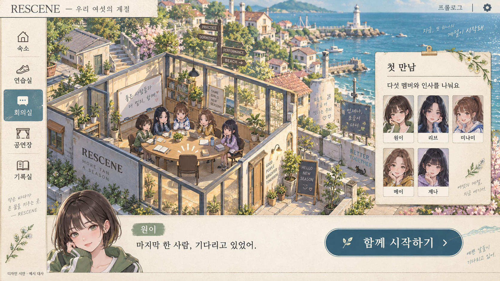
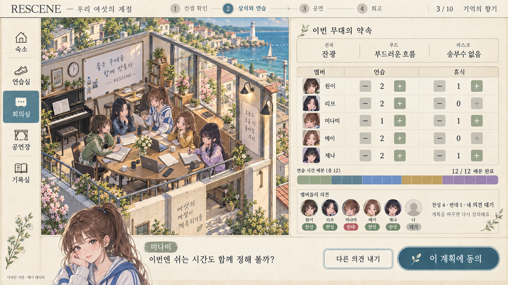
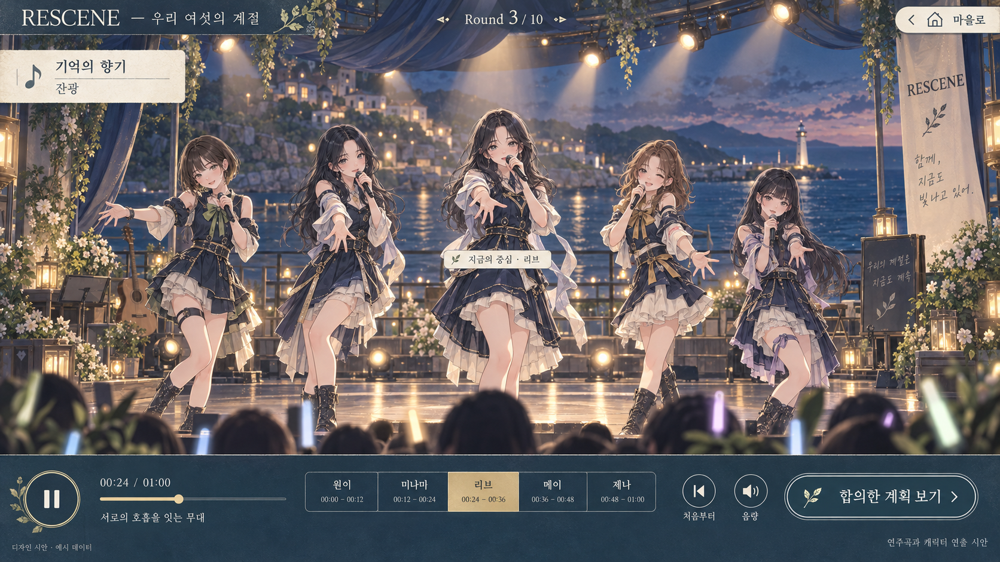
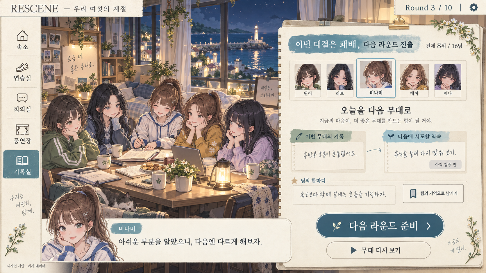
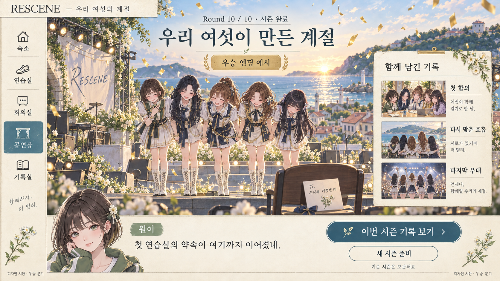

# 우리 여섯의 계절 — 대표 장면 UI/UX 시안

2026-09-28 · 1차 디자인 검토용 · 게임에 미적용

최신 서바이벌 방향의 합류 → 준비 → 공연 → 회고 → 결승을 다섯 대표 장면으로 시각화했습니다. 이전 판타지 개인 캠페인이나 동네 경영판을 각각 다시 설계한 자료는 아닙니다. 대사, 순위, 일정, 투표와 우승 장면은 예시이며 실제 시즌 기록이 아닙니다.

## 디자인 방향

등각 해안 마을과 대화 중심 육성 게임을 결합합니다. 종이 패널과 잉크색 버튼은 마을에서 길을 찾게 하고, 공연에서는 남색 무대와 금빛 조명으로 전환합니다. 게임 캐릭터는 창작 시각 콘셉트로 실제 멤버 외모의 재현을 주장하지 않습니다.

- 색: 바다 #8CBBC4, 잎 #A8C29A, 잉크 #344C5D, 종이 #EEE5CC, 지붕 #B88678, 황동 #D8BA7D.
- 글자: 이야기 제목은 한글 명조, 조작·수치는 가독성 높은 고딕. 이미지의 글자는 생성형 래스터 표현이며 실제 폰트 지정 결과가 아닙니다.
- 구도: 장소 탐색은 왼쪽, 현재 과제는 오른쪽, 대화는 하단. 공연 중에는 장소 메뉴를 줄이고 무대와 재생 조작을 우선합니다.
- 공통 원칙: 화면별 주요 행동 하나, 버튼에 동작 명시, 상태를 색과 글자로 함께 표시, 사용자 의견과 멤버 의견 구분.

## 1. 합류 — 첫 만남

빈 여섯 번째 자리와 첫 인사로 사용자의 역할을 전달합니다. 주요 행동: **함께 시작하기**.

## 2. 준비 — 함께 정하는 무대

다섯 멤버의 연습·휴식 배분과 여섯 명의 찬반을 한 화면에서 확인합니다. 주요 행동: **이 계획에 동의**.

## 3. 공연 — 우리의 60초

관전을 중심으로 파트 탐색·일시정지·음량 조절만 남깁니다. 주요 행동: **재생 / 일시정지**.

## 4. 회고 — 아쉬움도 다음 무대의 힘으로

대결 패배와 시즌 탈락을 구분하고, 지난 결과와 다음 가설을 나란히 보여 줍니다. 주요 행동: **다음 라운드 준비**.

## 5. 결승 — 열 번의 무대, 우리의 계절

우승 분기의 예시로, 공동의 기억과 시즌 보관을 강조합니다. 주요 행동: **이번 시즌 기록 보기**.

## 구현 전 확인할 UX 계약

- 준비: 예시 표의 연습 9 + 휴식 3 = 총 12입니다. 생성 이미지의 색 막대 칸수는 정확한 데이터 표현이 아니므로 실제 UI에서는 표와 동일한 12칸으로 렌더링해야 합니다. 이 시안에서 계획 변경은 재토론으로 연결되며, 동의 버튼이 무대를 자동 실행하지 않습니다.
- 회고: 다음 라운드 버튼은 필수 회고와 저장이 완료된 상태를 전제로 합니다. 미완료·오류 상태는 원인과 재시도 동작을 표시하고 진행을 잠급니다. 팀 기억 선택은 공개 회고에만 적용합니다.
- 공연: 목소리 재현 시안이 아닙니다. 기존 연주곡·캐릭터 연출을 보여 주며 실제 가창이나 음성 생성 구현을 약속하지 않습니다.
- 결승: 우승은 한 분기입니다. 탈락·준우승에도 시즌 회고를 제공하고, 새 시즌은 기존 기록 보관을 안내한 뒤 별도 확인으로 시작합니다.
- 모바일: 이번 산출물은 16:9 화면의 시각 시안입니다. 실제 터치·키보드·모바일 사용성 검증은 수행하지 않았습니다. 세로 화면에서는 지도/일정/대화를 전환하고 주요 행동을 하단에 유지하는 별도 설계가 필요합니다.
- 접근성: 후속 구현에서 터치 영역 최소 44px, 실제 텍스트 대비, 초점 이동, 키보드 탐색, 애니메이션 줄이기를 검증합니다. 이미지 시안만으로 접근성 통과를 주장하지 않습니다.
- 표현 보완: 캐릭터 헤어·의상과 손글씨 장식은 생성 과정에서 미세하게 달라집니다. 아트 방향 선택 후 모델시트와 정확한 한글 UI로 통일할 대상입니다.

## 제작·검토·적용 상태

내장 imagegen으로 첫 장면을 생성하고, 같은 이미지를 스타일·캐릭터 참고로 나머지 네 장면을 생성했습니다. 다섯 결과를 직접 열람하여 구도·주요 문구·상태 표시를 확인했습니다. 원본 프롬프트는 [prompts.json](prompts.json)에 보존했습니다. 이 문서와 이미지는 검토용이며 게임 코드·서버·시즌 저장은 변경하지 않았습니다.

다음 검토는 ① 캐릭터·배경의 화풍 ② 준비/회고 화면의 정보량 ③ 주요 행동의 위치 순으로 진행합니다.
